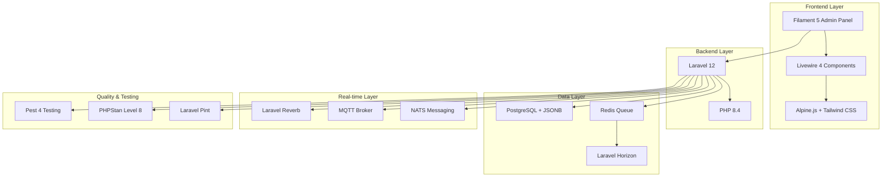
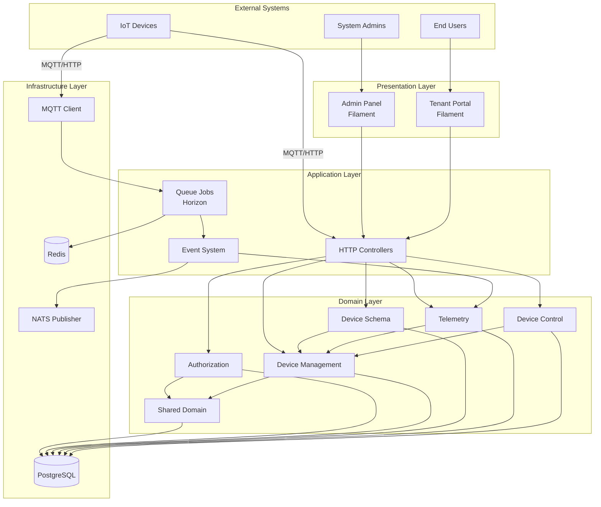
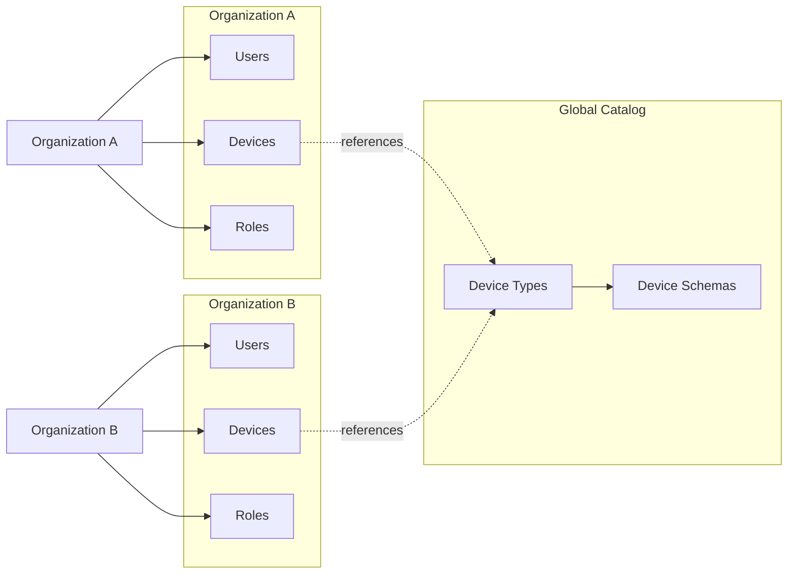
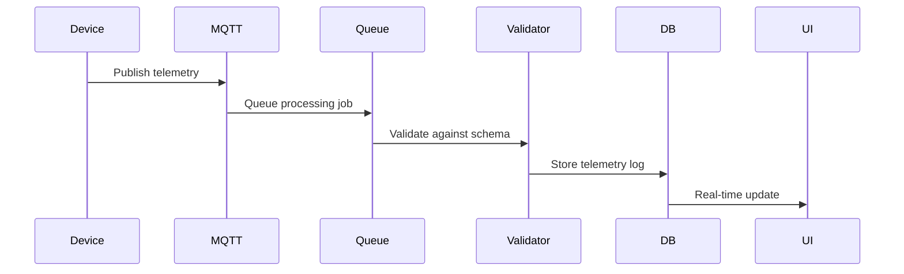

# Architecture Overview

## Introduction

The LMU IoT Portal is a **multi-tenant IoT device management platform** that enables organizations to:
- Onboard and manage IoT devices
- Define flexible device schemas with versioning
- Ingest telemetry data via MQTT and HTTP
- Send commands and control devices
- Monitor device states in real-time

## Technology Stack

## High-Level Architecture

## System Components

### 1. Presentation Layer
- **Admin Panel**: Global device type catalog management, system administration
- **Tenant Portal**: Organization-scoped device management, monitoring, and control

### 2. Application Layer
- **HTTP Controllers**: Handle incoming HTTP requests
- **Queue Jobs**: Process asynchronous tasks via Laravel Horizon
- **Event System**: Real-time event broadcasting and handling

### 3. Domain Layer
Organized by business domains following Domain-Driven Design principles:

- **Shared**: Common models (User, Organization)
- **Authorization**: Role-based access control with organization-level permissions
- **Device Management**: Device types, devices, and lifecycle management
- **Device Schema**: Flexible schema versioning system
- **Telemetry**: Incoming data validation and logging
- **Device Control**: Commands and desired state management

### 4. Infrastructure Layer
- **PostgreSQL**: Primary data store with JSONB for flexible schemas
- **Redis**: Queue backend and caching
- **MQTT Client**: Subscribes to device messages
- **NATS**: Publishes events to external systems

## Multi-Tenancy Model

### Tenant Scoping
- All organization-specific data is scoped by `organization_id`
- Device types can be global (shared catalog) or organization-specific
- Users can belong to multiple organizations with different roles per organization
- Middleware automatically applies tenant scopes to queries

## Key Design Principles

1. **Tenant Boundary**: Everything attaches to `organizations.id`
2. **Versioned Schema Contract**: Schema changes create new versions; active versions are immutable
3. **Relational, Normalized**: Child tables reference parents; minimal data redundancy
4. **Stable Device Identity**: `devices.uuid` is the stable public identifier
5. **Type-Safe Configuration**: Protocol configs use PHP classes, not raw JSON
6. **Event-Driven Architecture**: Asynchronous processing for telemetry ingestion

## Data Flow Overview

See detailed data flow diagrams in:
- [Telemetry Flow](./03-telemetry-flow.md)
- [Command Flow](./04-command-flow.md)
