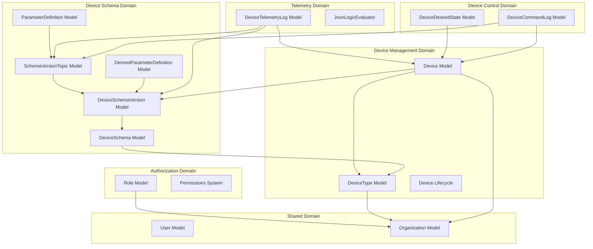
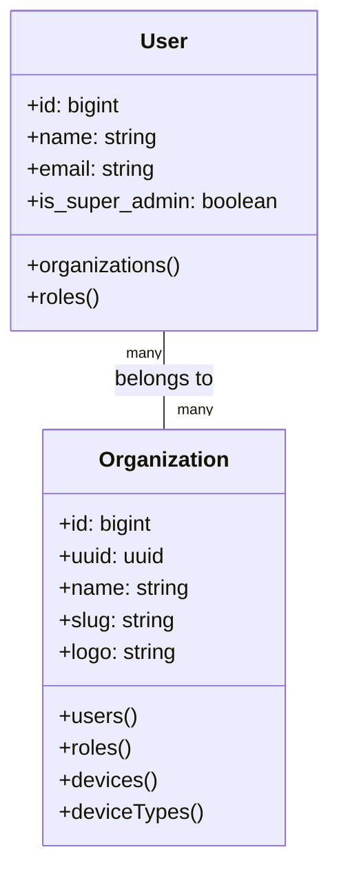
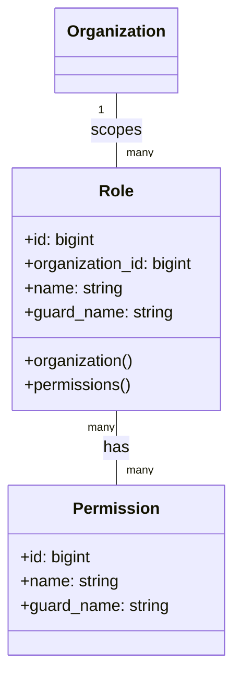
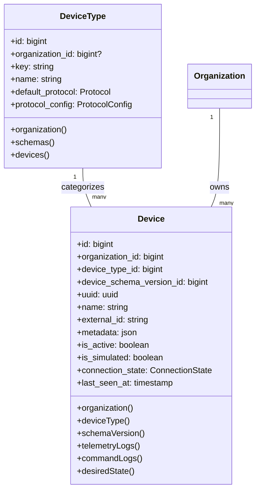
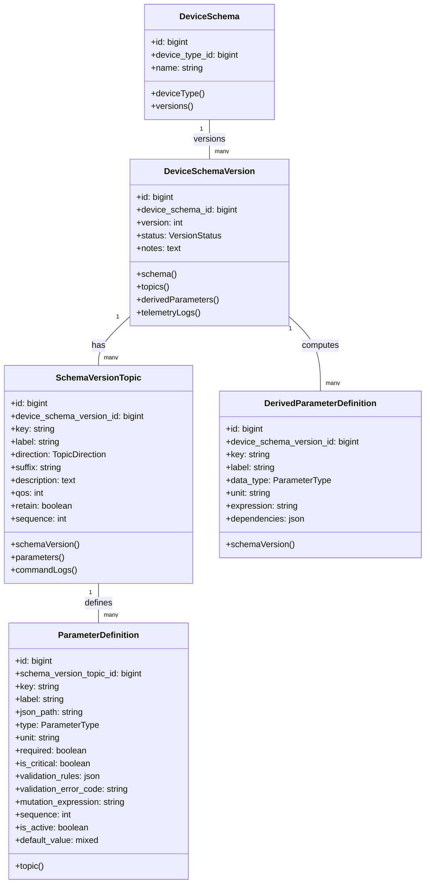
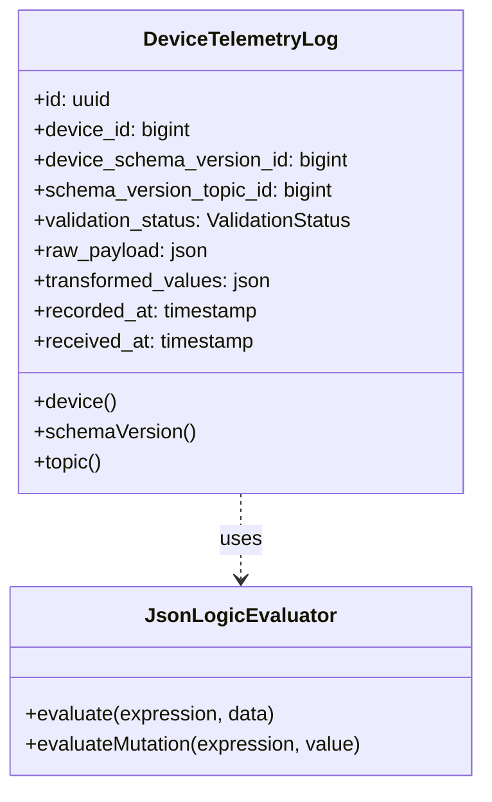
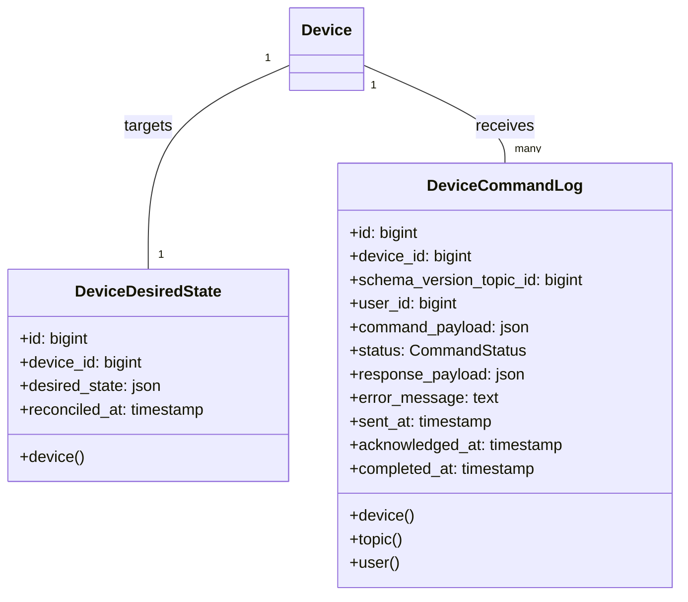
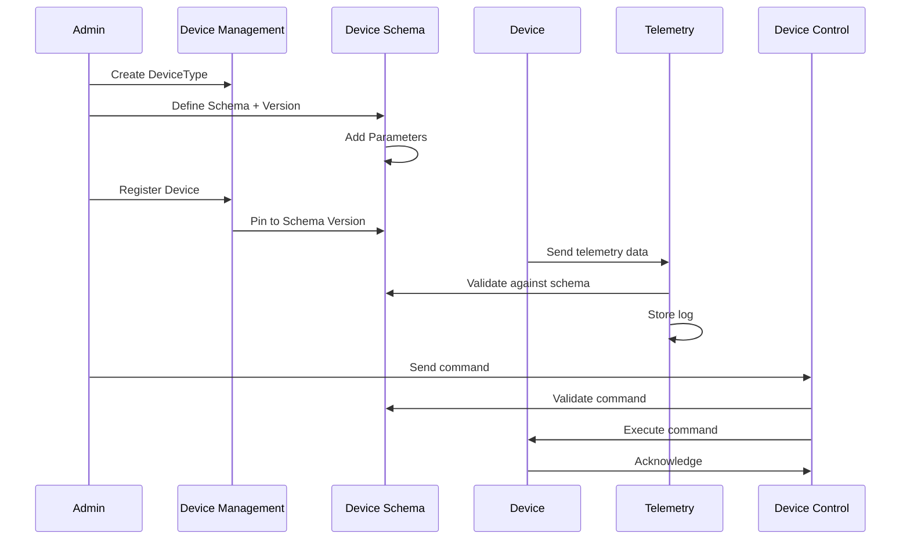

# Domain Layer Architecture

## Overview

The domain layer is organized following **Domain-Driven Design (DDD)** principles, with each domain encapsulating its own models, business logic, and responsibilities.

## Domain Details

### 1. Shared Domain

**Purpose**: Common models and functionality shared across all domains.

**Key Responsibilities**:
- User authentication and profile management
- Organization (tenant) management
- Many-to-many user-organization relationships

---

### 2. Authorization Domain

**Purpose**: Role-based access control with organization-level scoping.

**Key Responsibilities**:
- Role creation and management per organization
- Permission assignment to roles
- User role assignment with organization context
- Policy enforcement via Laravel's authorization gates

**Integration**: Uses Spatie's Laravel-Permission package with custom organization scoping.

---

### 3. Device Management Domain

**Purpose**: Device catalog and instance management.

**Key Responsibilities**:
- Device type catalog (global + organization-specific)
- Device registration and provisioning
- Device lifecycle management (activation, deactivation, soft delete)
- Connection state tracking
- Protocol configuration (MQTT/HTTP)

**Protocol Configuration**: Type-safe classes implementing `ProtocolConfigInterface`:
- `MqttProtocolConfig`: Broker settings, topic templates, QoS
- `HttpProtocolConfig`: Endpoints, methods, headers, auth

---

### 4. Device Schema Domain

**Purpose**: Flexible, versioned device data contracts.

**Key Responsibilities**:
- Schema definition and versioning
- Topic-based parameter organization (telemetry/command separation)
- Parameter validation rules and data types
- Derived parameter computation (expressions + dependencies)
- Schema immutability enforcement for active versions

**Versioning Strategy**:
- New versions created for schema changes
- Devices pin to specific schema version on registration
- Active versions are immutable (enforced in application logic)

---

### 5. Telemetry Domain

**Purpose**: Incoming device data validation and logging.

**Key Responsibilities**:
- Validate incoming telemetry against schema version
- Extract parameters using JSON paths
- Apply mutation expressions to transform values
- Log validation results (success/failure with details)
- Store raw payload + transformed values

**Validation Flow**:
1. Match incoming message to device + topic
2. Extract parameters using defined JSON paths
3. Apply mutation expressions (e.g., unit conversions)
4. Validate against parameter rules
5. Compute derived parameters
6. Store log with validation status

---

### 6. Device Control Domain

**Purpose**: Command execution and desired state management.

**Key Responsibilities**:
- Store desired device state for reconciliation
- Log command execution with status tracking
- Track command acknowledgment and completion
- Audit trail for device control actions

**Command Flow**:
1. User initiates command via UI
2. Validate command against schema
3. Create command log entry
4. Publish to device via protocol
5. Track acknowledgment and completion
6. Update desired state if applicable

---

## Cross-Domain Interactions

## Design Patterns

- **Repository Pattern**: Models act as repositories for domain entities
- **Service Layer**: Domain-specific services handle complex business logic
- **Event-Driven**: Domain events trigger cross-domain actions
- **Immutability**: Active schema versions are immutable
- **Soft Deletes**: Preserves data integrity and audit trail
