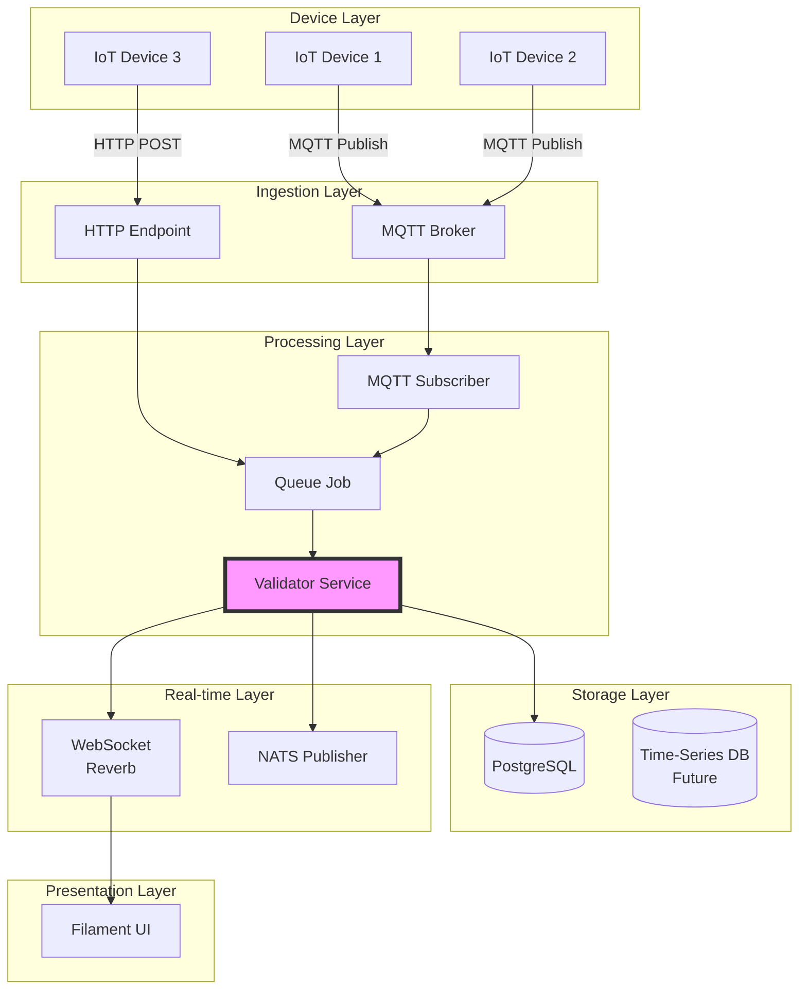
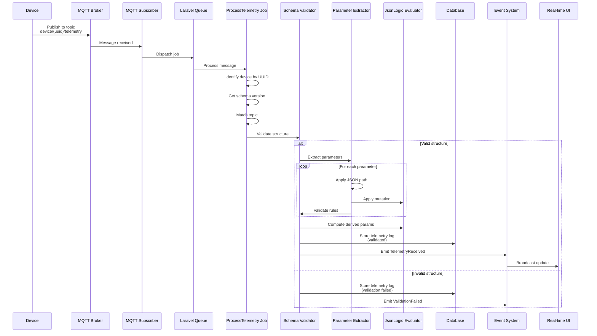
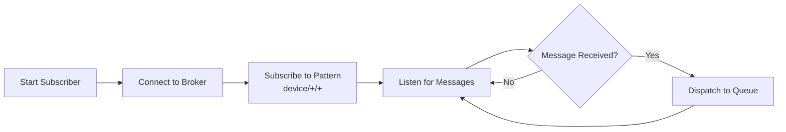
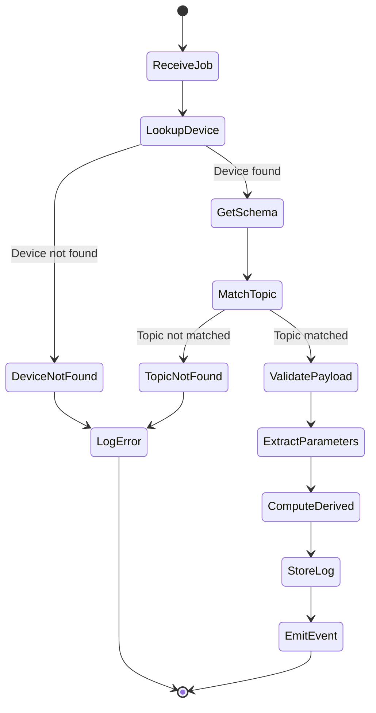
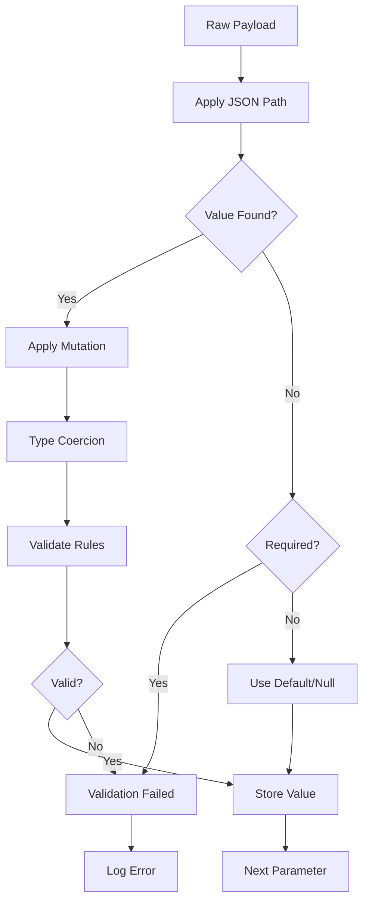
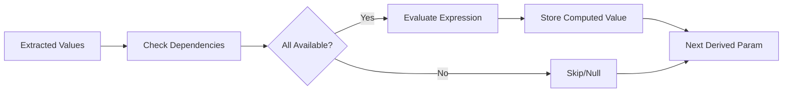
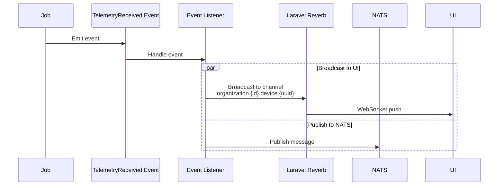
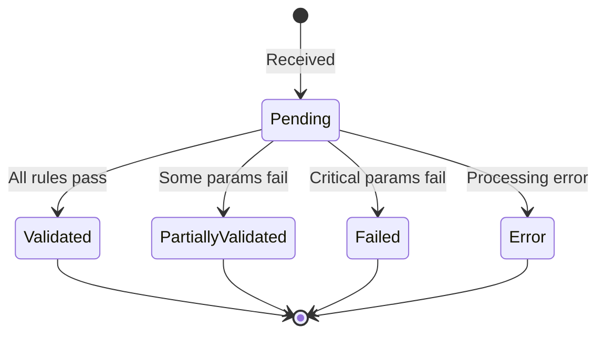
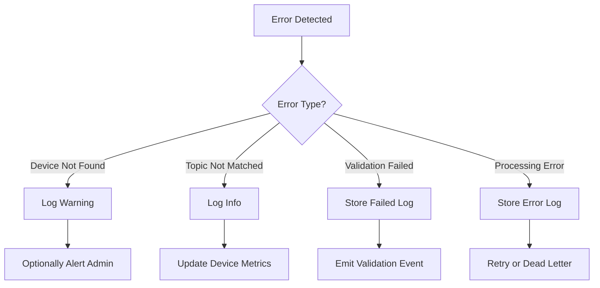

# Telemetry Data Flow

## Overview

This document describes how telemetry data flows from IoT devices through the platform to storage and real-time updates.

## High-Level Flow



## Detailed Telemetry Flow



## Component Breakdown

### 1. Device Publishing

Devices publish to topic patterns defined in their schema:

**MQTT Topic Pattern**:
```
device/{device_uuid}/{topic_suffix}
```

**Example Topics**:
- `device/550e8400-e29b-41d4-a716-446655440000/telemetry`
- `device/550e8400-e29b-41d4-a716-446655440000/status`
- `device/550e8400-e29b-41d4-a716-446655440000/error`

**Payload Example** (JSON):
```json
{
  "timestamp": "2026-02-08T01:30:00Z",
  "voltage": 230.5,
  "current": 15.2,
  "power": 3503.6,
  "temperature": 42.8,
  "errors": []
}
```

### 2. MQTT Subscriber

The MQTT subscriber runs as a long-lived process:



**Key Features**:
- Subscribes to wildcard pattern `device/+/+`
- Extracts device UUID and topic suffix from received topic
- Dispatches job to queue for async processing
- Handles reconnection and error recovery

### 3. Queue Processing

**Job**: `ProcessDeviceTelemetry`



### 4. Parameter Extraction

For each parameter defined in the schema:



**JSON Path Examples**:
- `$.voltage` → extracts top-level voltage field
- `$.sensors[0].temperature` → extracts from array
- `$.data.metrics.power` → nested object navigation

**Mutation Examples**:
- Convert Fahrenheit to Celsius: `{"*": [{"var": "value"}, 0.5556]}`
- Scale value: `{"/": [{"var": "value"}, 1000]}`
- Clamp range: `{"min": [{"max": [{"var": "value"}, 0]}, 100]}`

### 5. Derived Parameter Computation

Computed from other parameters using JsonLogic expressions:



**Example Derived Parameter**:
- **Power Factor**: `{"*": [{"var": "power"}, {"/": [1, {"*": [{"var": "voltage"}, {"var": "current"}]}]}]}`
- **Energy (kWh)**: `{"/": [{"var": "power"}, 1000]}`

### 6. Storage

**DeviceTelemetryLog Record**:
```json
{
  "id": "uuid-v7",
  "device_id": 123,
  "device_schema_version_id": 45,
  "schema_version_topic_id": 12,
  "validation_status": "validated",
  "raw_payload": {/* original JSON */},
  "transformed_values": {
    "voltage": 230.5,
    "current": 15.2,
    "power": 3503.6,
    "temperature": 42.8,
    "power_factor": 0.99,
    "energy_kwh": 3.5036
  },
  "recorded_at": "2026-02-08T01:30:00Z",
  "received_at": "2026-02-08T01:30:01Z"
}
```

### 7. Real-time Broadcasting



**Broadcasting Channels**:
- Organization-level: `organization.{org_id}.telemetry`
- Device-level: `organization.{org_id}.device.{device_uuid}`

## Validation States



**Validation Status Values**:
- `validated`: All parameters passed validation
- `partially_validated`: Non-critical parameters failed
- `failed`: Critical parameters failed or structure invalid
- `error`: Processing error occurred

## Error Handling



## Performance Considerations

### Optimization Strategies

1. **Queue Workers**: Run multiple workers for parallel processing
2. **Batch Processing**: Group parameter extractions where possible
3. **Caching**: Cache schema versions and parameter definitions
4. **Indexing**: Database indexes on device_id, device_uuid, recorded_at
5. **Partitioning**: Future time-series partitioning for telemetry logs

### Monitoring Metrics

- Messages received per second
- Processing latency (received → stored)
- Validation success rate
- Queue depth and worker utilization
- Failed message rate

## Future Enhancements

- Time-series database integration (TimescaleDB/InfluxDB)
- Aggregation and downsampling
- Advanced anomaly detection
- Stream processing for real-time analytics
- Message deduplication
