# Command & Control Flow

## Overview

This document describes how commands are sent from the platform to IoT devices and how device state is managed.

## High-Level Flow

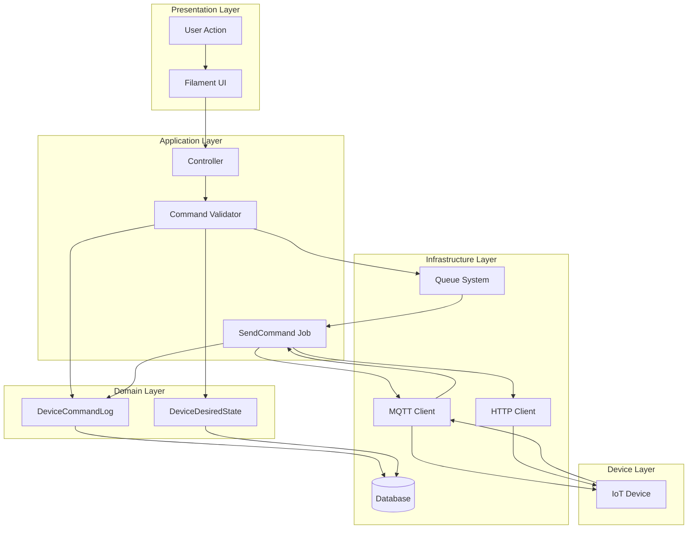

## Detailed Command Flow

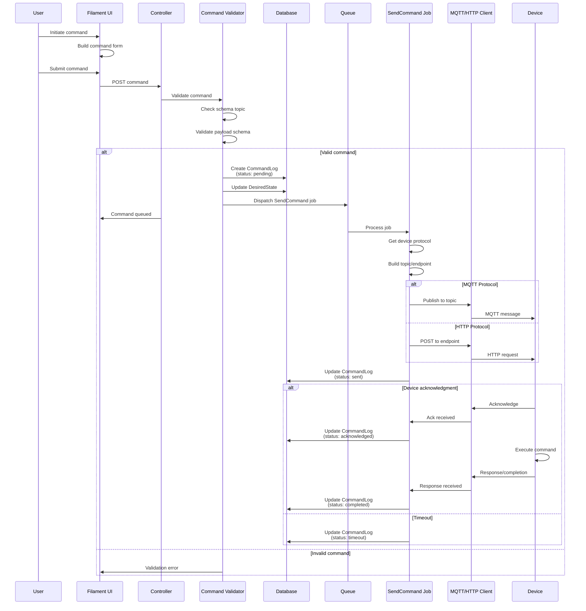

## Component Breakdown

### 1. Command Initiation

Commands are initiated through Filament UI actions:

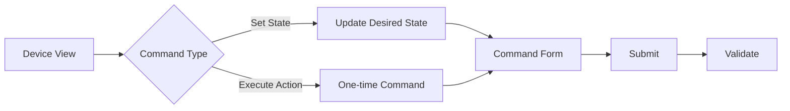

**Command Types**:
- **State Commands**: Set persistent desired state (e.g., set temperature to 22°C)
- **Action Commands**: One-time actions (e.g., reboot, calibrate)
- **Configuration Commands**: Update device settings (e.g., sampling rate)

### 2. Command Validation

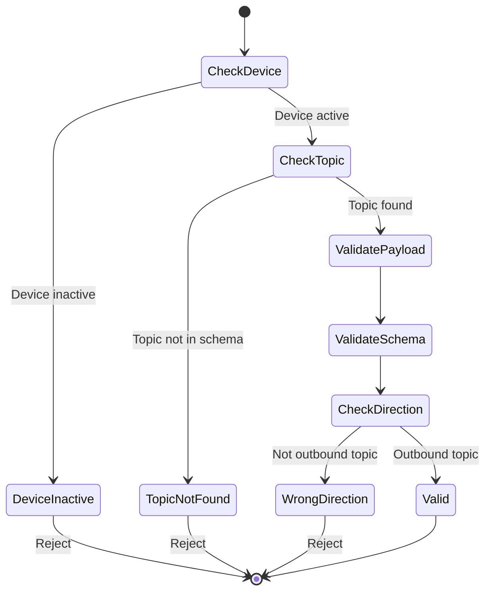

**Validation Steps**:
1. Device exists and is active
2. Topic exists in device's schema version
3. Topic direction is `outbound` or `bidirectional`
4. Payload matches topic's payload schema
5. User has permission to send commands

### 3. Command Persistence

**DeviceCommandLog Lifecycle**:

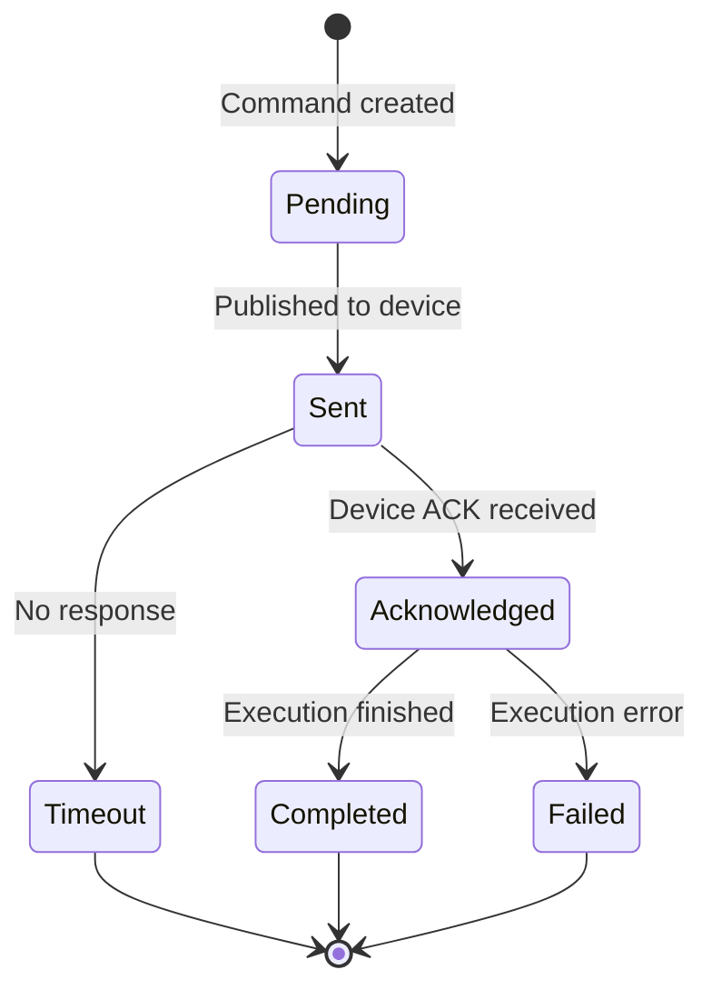

**DeviceCommandLog Fields**:
```json
{
  "id": 123,
  "device_id": 456,
  "schema_version_topic_id": 12,
  "user_id": 789,
  "command_payload": {
    "action": "set_temperature",
    "value": 22.0,
    "unit": "celsius"
  },
  "status": "completed",
  "response_payload": {
    "success": true,
    "previous_value": 20.0,
    "new_value": 22.0
  },
  "error_message": null,
  "sent_at": "2026-02-08T01:30:00Z",
  "acknowledged_at": "2026-02-08T01:30:01Z",
  "completed_at": "2026-02-08T01:30:03Z"
}
```

### 4. Desired State Management

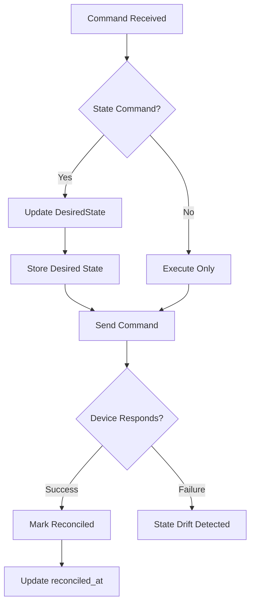

**DeviceDesiredState Example**:
```json
{
  "id": 1,
  "device_id": 456,
  "desired_state": {
    "temperature_setpoint": 22.0,
    "mode": "cooling",
    "fan_speed": "auto",
    "enabled": true
  },
  "reconciled_at": "2026-02-08T01:30:03Z"
}
```

### 5. Protocol-Specific Publishing

#### MQTT Protocol

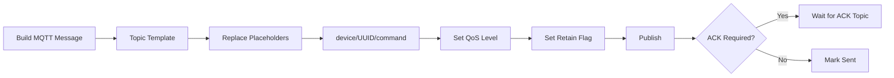

**MQTT Topic Pattern**:
```
device/{device_uuid}/command
device/{device_uuid}/config
```

**MQTT Message**:
```json
{
  "command_id": "cmd_123",
  "timestamp": "2026-02-08T01:30:00Z",
  "payload": {
    "action": "set_temperature",
    "value": 22.0
  }
}
```

**ACK Topic** (device responds to):
```
device/{device_uuid}/command/ack
```

#### HTTP Protocol

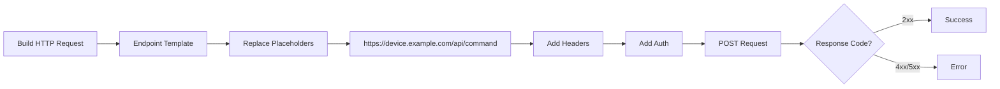

**HTTP Endpoint Pattern**:
```
https://{device_host}/api/v1/command
```

**HTTP Request**:
```http
POST /api/v1/command HTTP/1.1
Host: device.example.com
Authorization: Bearer {device_token}
Content-Type: application/json

{
  "command_id": "cmd_123",
  "action": "set_temperature",
  "value": 22.0
}
```

### 6. Device Acknowledgment

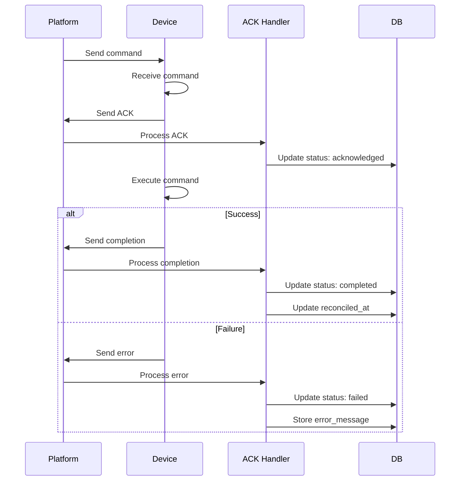

### 7. State Reconciliation

The platform monitors state drift between desired and reported state:

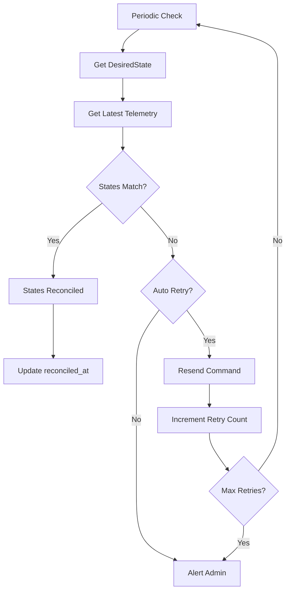

## Command Topics Configuration

Topics are defined in the `SchemaVersionTopic` model:

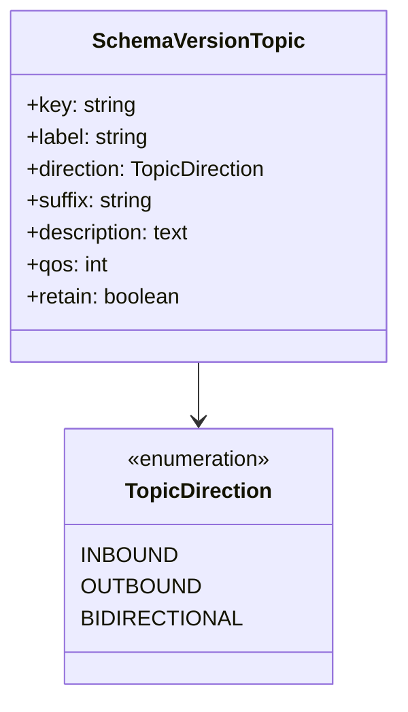

**Example Topic Definitions**:

| Key | Direction | Suffix | QoS | Description |
|-----|-----------|--------|-----|-------------|
| telemetry | inbound | telemetry | 1 | Device sensor data |
| command | outbound | command | 2 | Control commands |
| config | outbound | config | 2 | Configuration updates |
| status | bidirectional | status | 1 | Device status |

## Error Handling

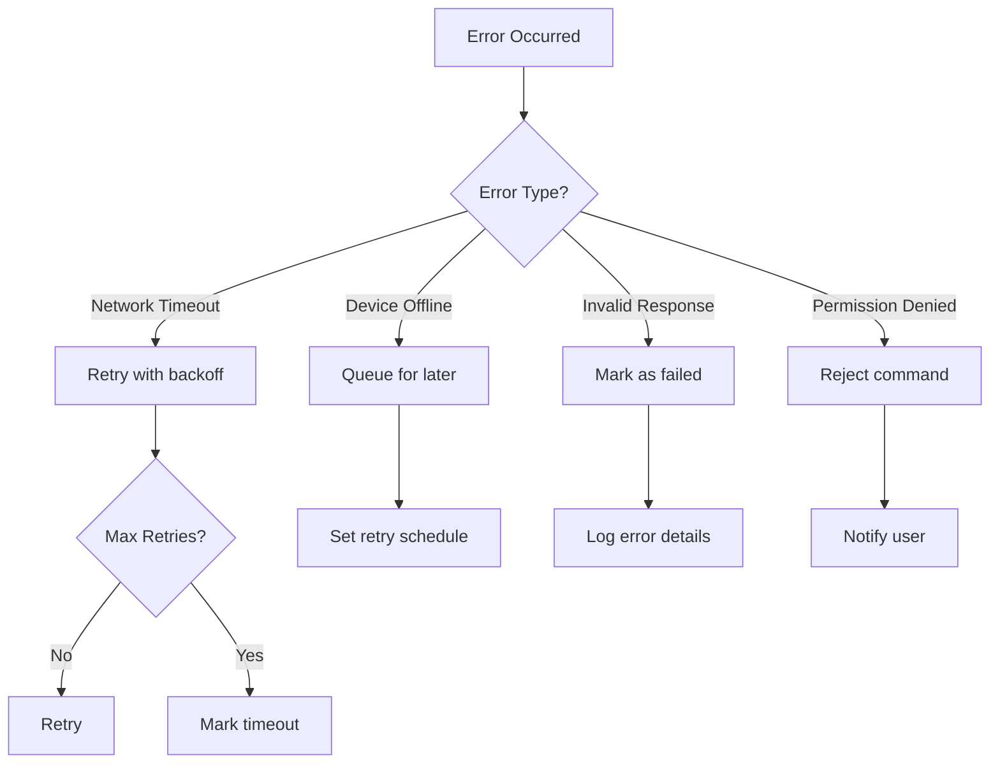

## Security Considerations

1. **Command Authorization**: Users must have appropriate permissions
2. **Payload Validation**: All commands validated against schema
3. **Rate Limiting**: Prevent command flooding
4. **Audit Trail**: All commands logged with user, timestamp, result
5. **Device Authentication**: Devices verify command source

## Performance Considerations

- **Asynchronous Processing**: Commands queued and sent asynchronously
- **Batch Commands**: Support sending same command to multiple devices
- **Timeout Management**: Configurable timeouts per device type
- **Retry Strategy**: Exponential backoff for failed commands

## Future Enhancements

- Command scheduling and cron-like execution
- Conditional commands based on device state
- Command templates and saved presets
- Bulk command operations
- Command impact analysis before execution
- Rollback mechanisms for configuration changes
