# Authentication & Authorization

## Overview

The platform implements a multi-tenant role-based access control (RBAC) system where users can belong to multiple organizations with different roles in each.

## Architecture

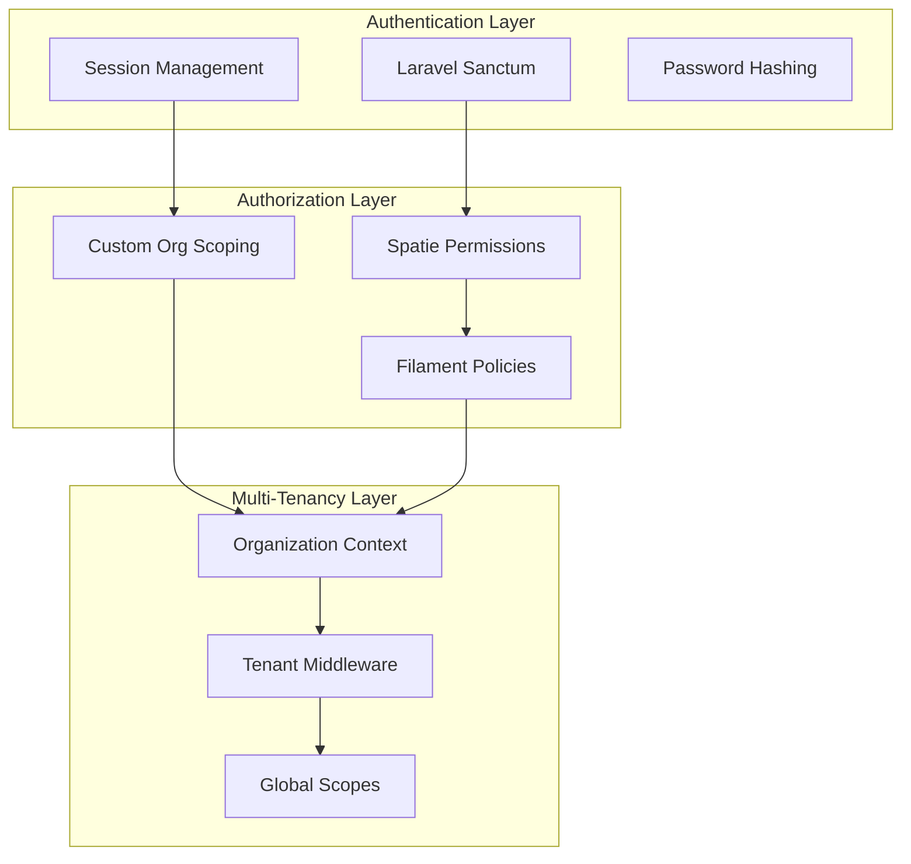

## User Authentication

### Authentication Flow

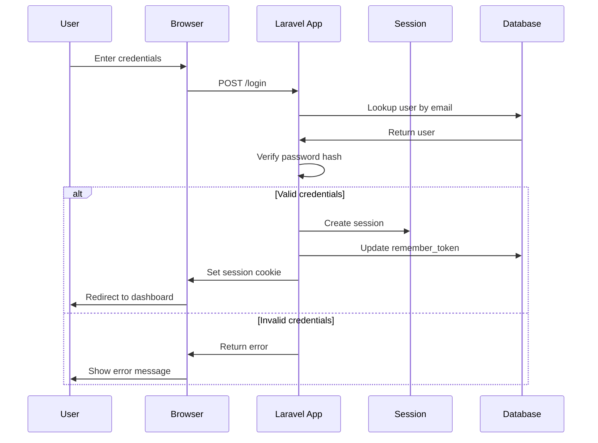

### User Model

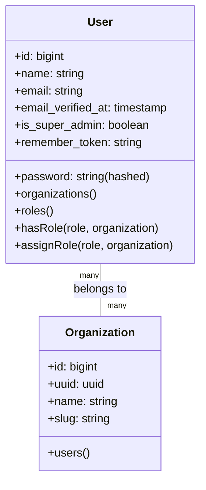

**Key Features**:
- Email-based authentication
- Bcrypt password hashing
- Session-based authentication (web)
- Super admin flag for platform administrators
- Email verification support

## Multi-Tenant Authorization

### Organization Context

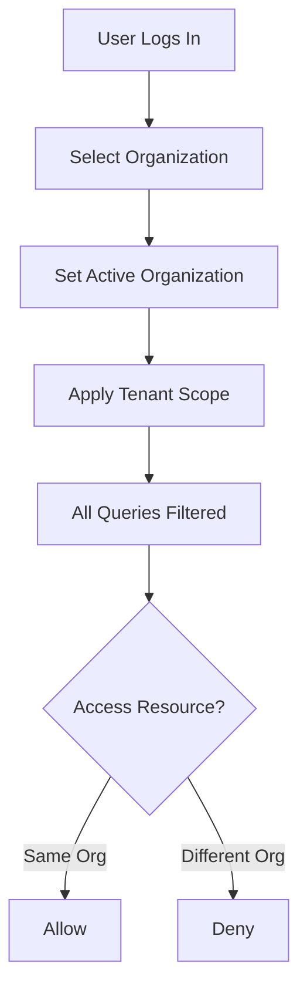

### Tenant Middleware

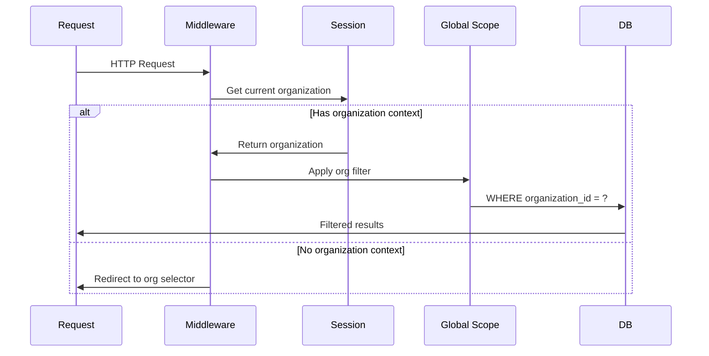

**Scoped Models**:
- Device
- DeviceType (organization-specific)
- Role
- DeviceCommandLog
- DeviceTelemetryLog
- DeviceDesiredState

**Global Models** (not scoped):
- User
- Organization
- DeviceType (global catalog)
- DeviceSchema
- DeviceSchemaVersion

### Organization Selection

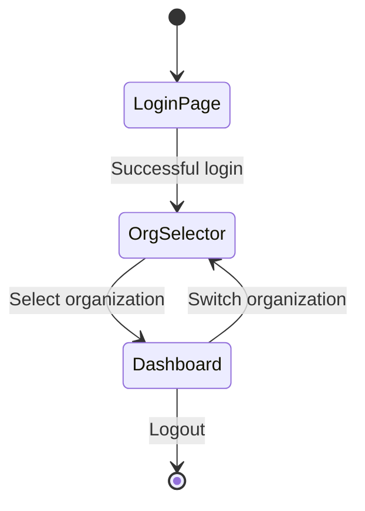

## Role-Based Access Control

### Permission System

Built on Spatie's Laravel-Permission with custom organization scoping:

```mermaid
graph TB
    subgraph "Super Admin"
        SA[Super Admin User]
        SA_PERM[All Permissions<br/>All Organizations]
    end
    
    subgraph "Organization Admin"
        OA[Org Admin User]
        OA_ROLE[Admin Role]
        OA_PERM[Org Management<br/>Device Management<br/>User Management]
    end
    
    subgraph "Device Operator"
        OP[Operator User]
        OP_ROLE[Operator Role]
        OP_PERM[View Devices<br/>Send Commands<br/>View Telemetry]
    end
    
    subgraph "Device Viewer"
        VW[Viewer User]
        VW_ROLE[Viewer Role]
        VW_PERM[View Devices<br/>View Telemetry]
    end
    
    SA --> SA_PERM
    OA --> OA_ROLE
    OA_ROLE --> OA_PERM
    OP --> OP_ROLE
    OP_ROLE --> OP_PERM
    VW --> VW_ROLE
    VW_ROLE --> VW_PERM
```

### Role Model

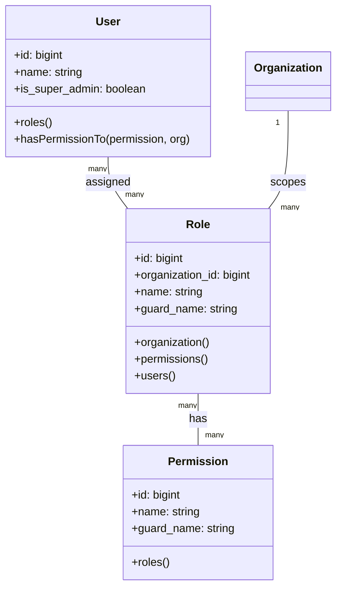

### Permission Naming Convention

Permissions follow the pattern: `{action}_{resource}`

**Device Management**:
- `view_devices`
- `create_devices`
- `edit_devices`
- `delete_devices`
- `control_devices` (send commands)

**Device Type Management**:
- `view_device_types`
- `create_device_types`
- `edit_device_types`
- `delete_device_types`

**Schema Management**:
- `view_schemas`
- `create_schemas`
- `edit_schemas`
- `delete_schemas`

**User Management**:
- `view_users`
- `create_users`
- `edit_users`
- `delete_users`
- `assign_roles`

**Telemetry**:
- `view_telemetry`
- `export_telemetry`

### Authorization Flow

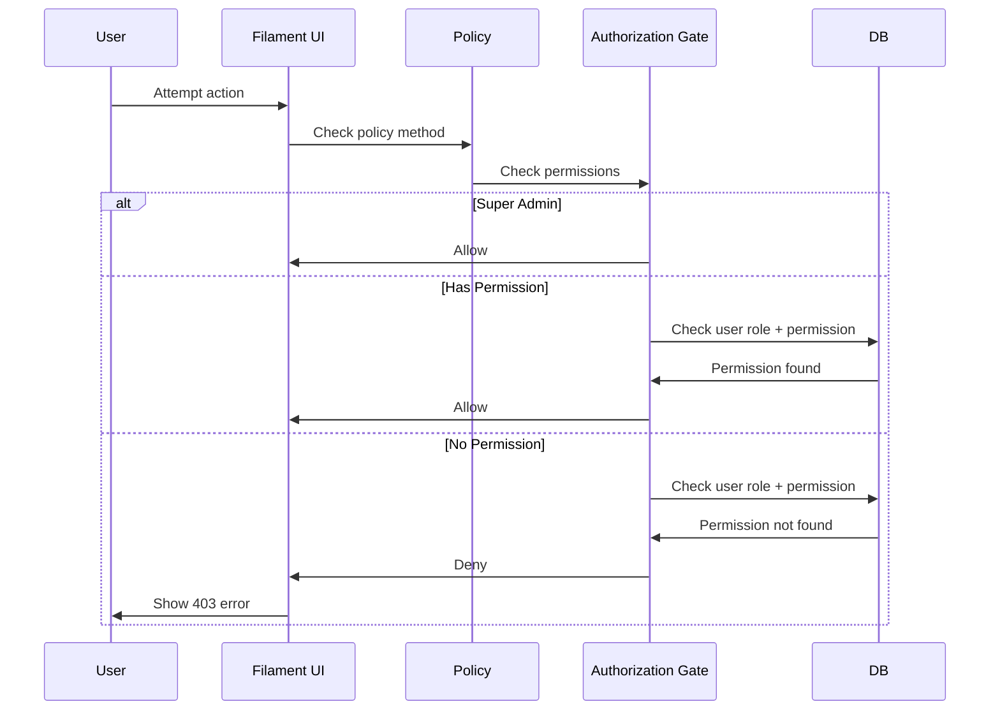

### Filament Resource Policies

Each Filament resource uses a policy class:

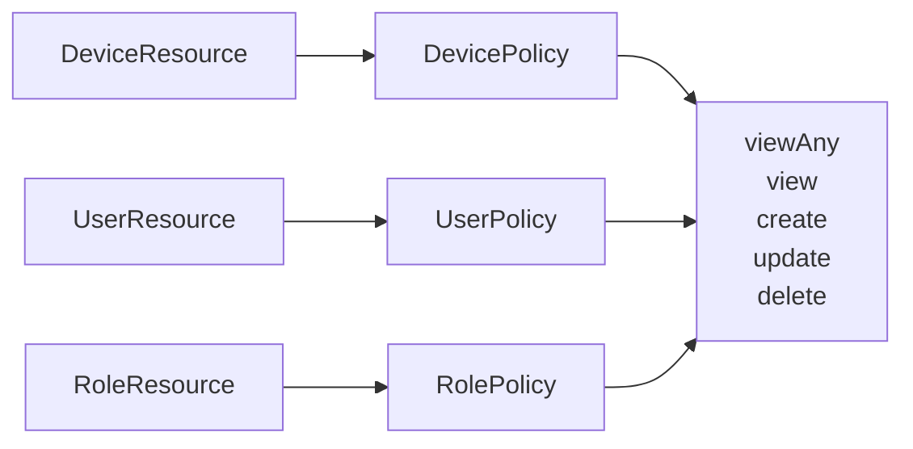

**Policy Methods**:
- `viewAny()`: Can see the list view
- `view()`: Can view individual record
- `create()`: Can create new record
- `update()`: Can edit existing record
- `delete()`: Can delete record
- `restore()`: Can restore soft-deleted record
- `forceDelete()`: Can permanently delete record

## Super Admin Access

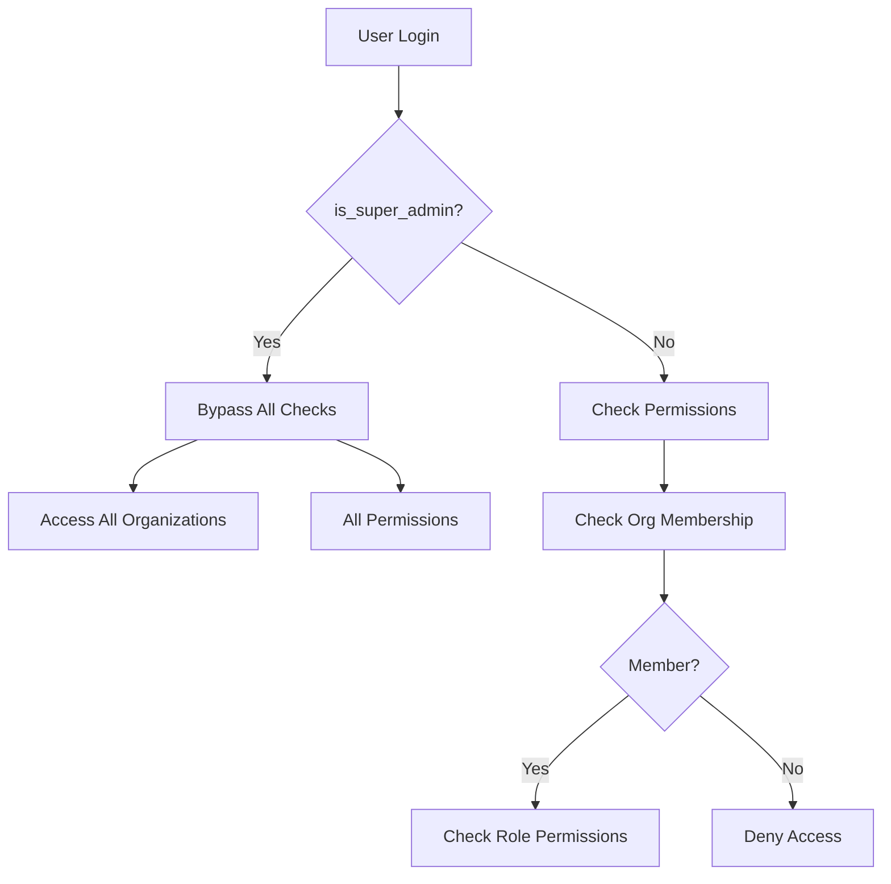

**Super Admin Privileges**:
- Access to all organizations
- Bypass all permission checks
- Manage global device type catalog
- View system-wide analytics
- Manage platform settings

## User-Organization Association

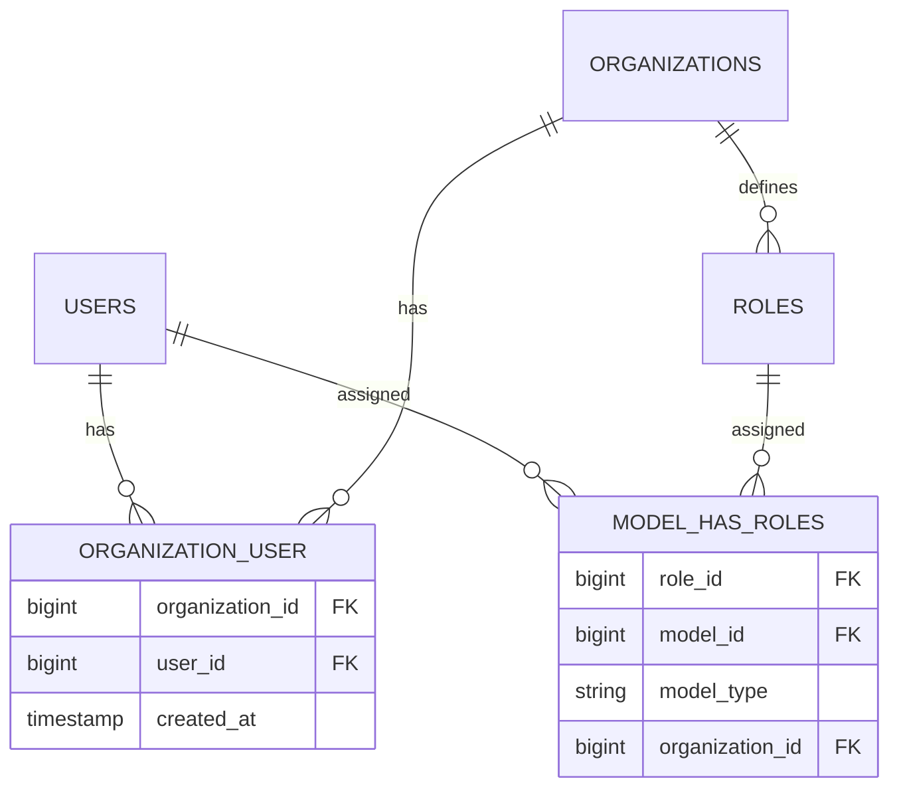

**Key Relationships**:
- Users can belong to multiple organizations
- Each user-organization pair can have multiple roles
- Roles are organization-scoped
- Permissions are checked within organization context

## Session Management

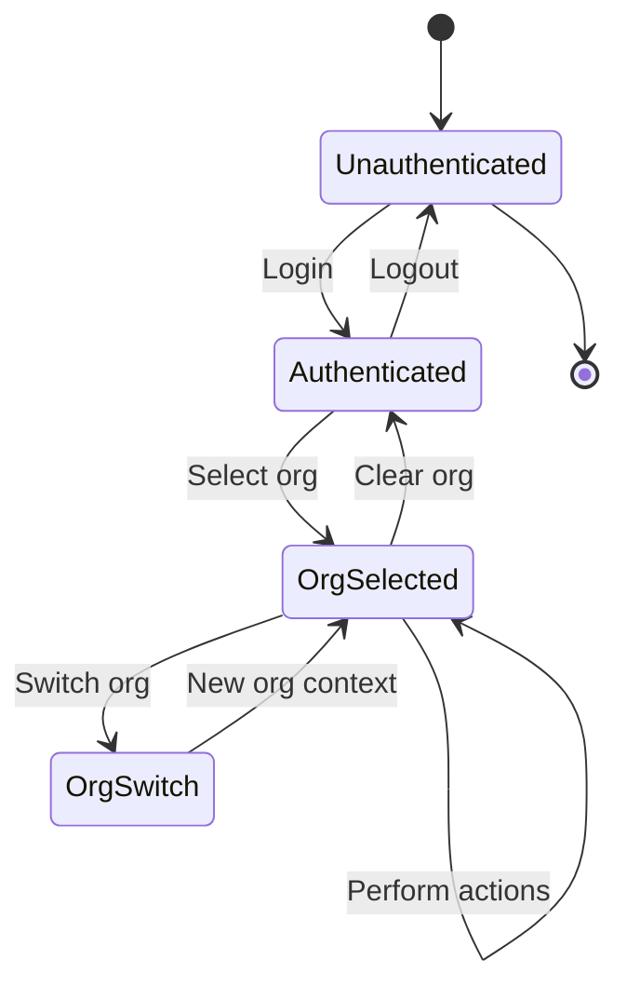

**Session Data**:
```php
[
    'user_id' => 123,
    'current_organization_id' => 456,
    'remember_token' => 'abc...',
    'last_activity' => '2026-02-08 01:30:00',
]
```

## API Authentication (Future)

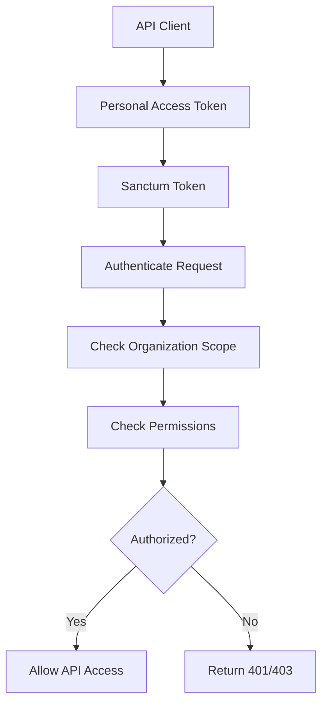

**Token Scopes** (planned):
- `devices:read`
- `devices:write`
- `telemetry:read`
- `commands:send`

## Security Best Practices

1. **Password Requirements**: Minimum 8 characters (configurable)
2. **Password Hashing**: Bcrypt with cost factor 10
3. **Session Security**: 
   - HTTP-only cookies
   - Secure flag in production
   - SameSite=Lax
4. **CSRF Protection**: Laravel's CSRF middleware on all state-changing operations
5. **Rate Limiting**: Login attempts limited to prevent brute force
6. **Two-Factor Authentication**: Planned for future release

## Audit Trail

All security-sensitive actions are logged:

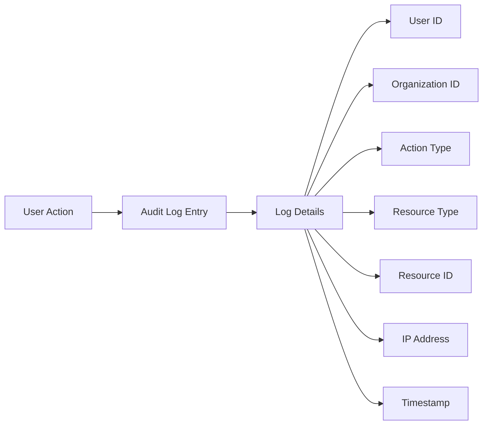

**Audited Actions**:
- Login/logout
- Organization switching
- Role assignments
- Permission changes
- Device commands
- Critical configuration changes
