# Deployment & Infrastructure

## Overview

The LMU IoT Portal is designed to be deployed in containerized environments with support for horizontal scaling and high availability.

## Deployment Architecture

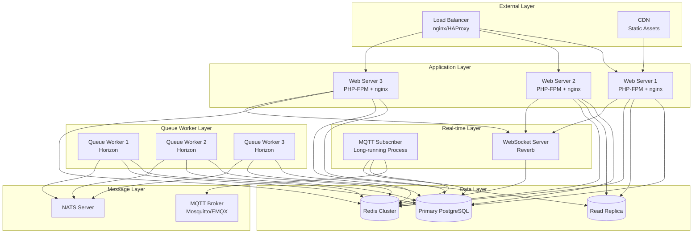

## Container Architecture

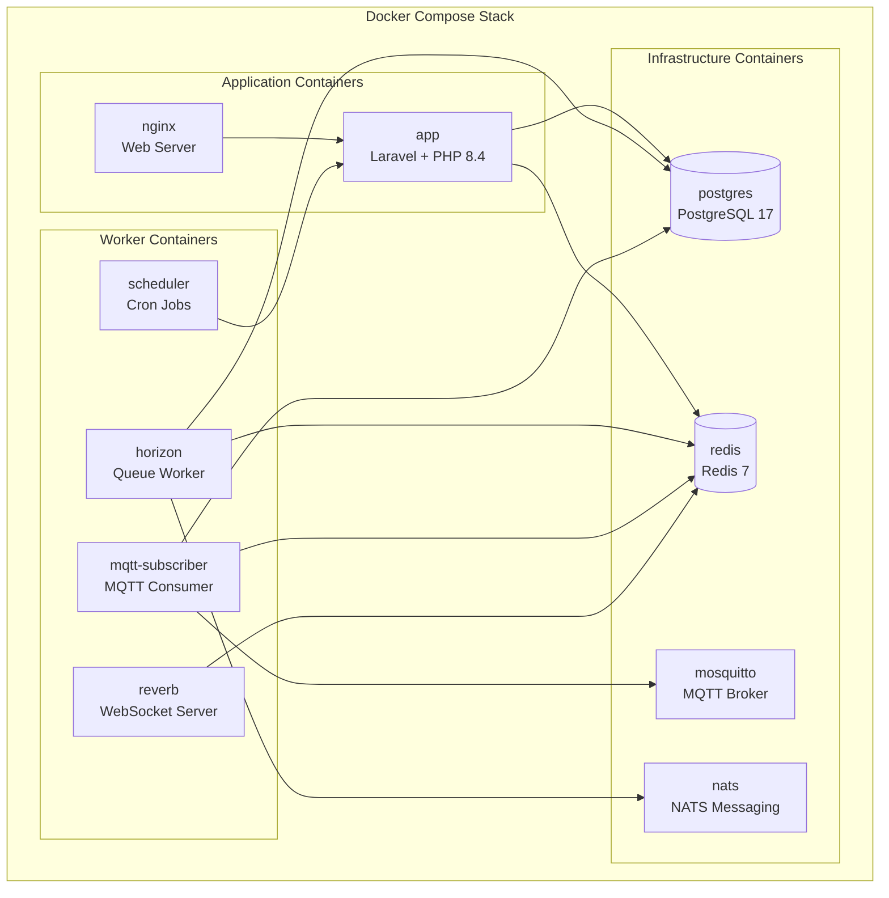

## Environment Configuration

### Development Environment

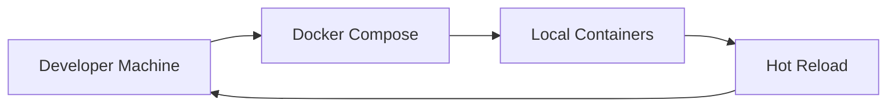

**docker-compose.yml** stack:
- `app`: Laravel application with Xdebug
- `nginx`: Web server on port 80
- `postgres`: PostgreSQL 17 with persistent volume
- `redis`: Redis 7 for cache and queues
- `horizon`: Queue worker with auto-restart
- `scheduler`: Laravel scheduler
- `mosquitto`: MQTT broker on port 1883
- `mailpit`: Email testing on port 8025

### Production Environment

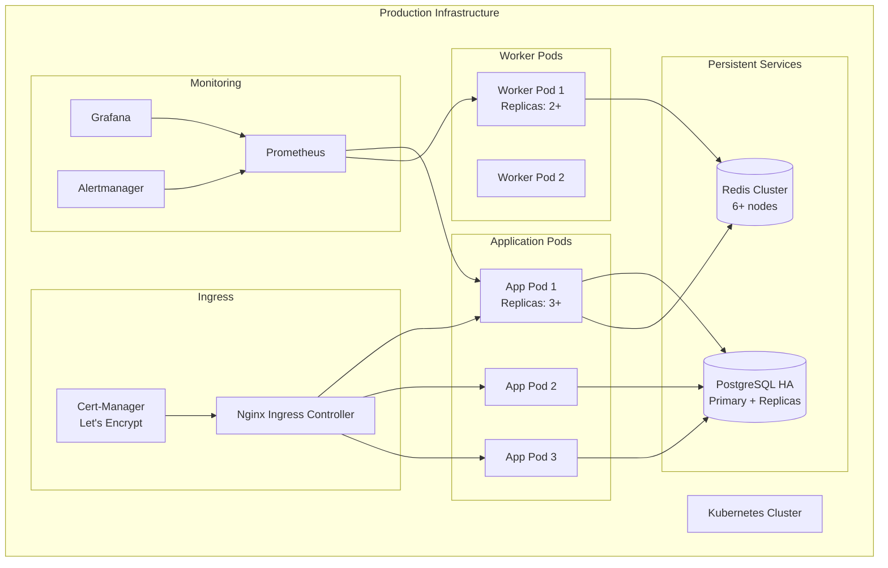

## Service Components

### 1. Web Application

**Technology**: PHP 8.4 + Laravel 12 + Filament 5

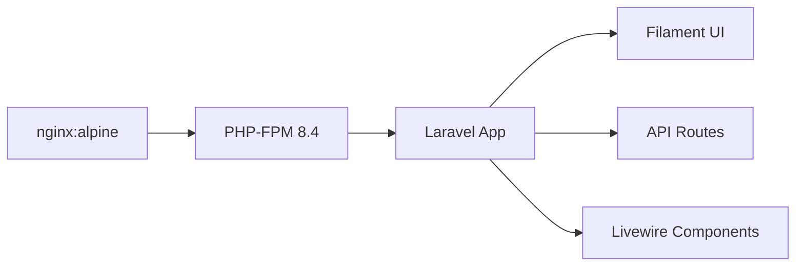

**Configuration**:
- PHP-FPM with OPcache enabled
- nginx as reverse proxy
- Static asset compilation with Vite
- Redis for session storage and cache

**Scaling**: Horizontal scaling via replicas (stateless)

### 2. Queue Workers (Horizon)

**Purpose**: Process asynchronous jobs

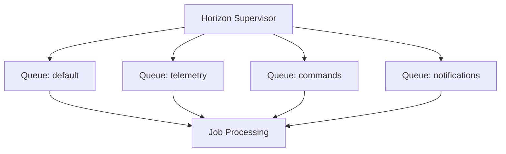

**Queue Configuration**:
- **default**: General background jobs
- **telemetry**: Telemetry processing (high priority)
- **commands**: Device command execution
- **notifications**: Email and event notifications

**Scaling**: Worker count per queue configurable

### 3. MQTT Subscriber

**Purpose**: Long-running process subscribing to device messages

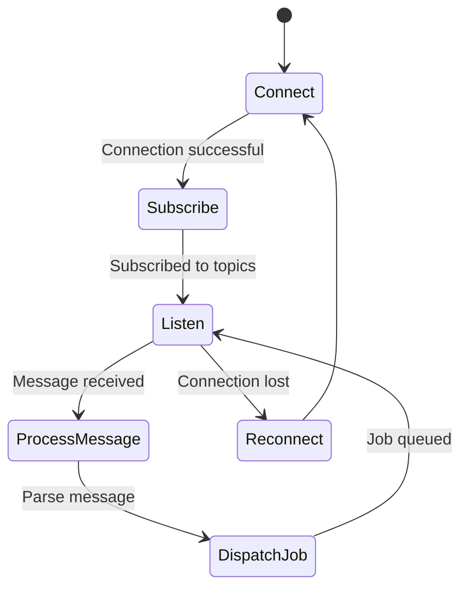

**Topics Subscribed**:
- `device/+/telemetry`
- `device/+/status`
- `device/+/error`
- `device/+/command/ack`

**Scaling**: Can run multiple subscribers with load balancing

### 4. WebSocket Server (Reverb)

**Purpose**: Real-time updates to UI

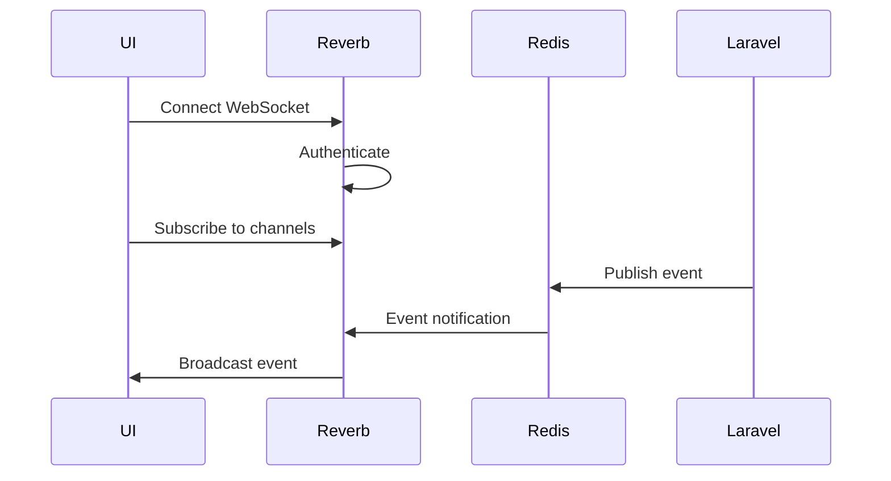

**Channels**:
- Private: `organization.{org_id}.device.{device_uuid}`
- Private: `organization.{org_id}.telemetry`
- Presence: `organization.{org_id}.online`

**Scaling**: Multiple Reverb instances with Redis pub/sub

### 5. Scheduler

**Purpose**: Run scheduled tasks

**Scheduled Tasks**:
- Database cleanup (old logs)
- State reconciliation checks
- Analytics aggregation
- Report generation
- Backup jobs

**Implementation**: Single scheduler pod with leader election

## Data Storage

### PostgreSQL Configuration

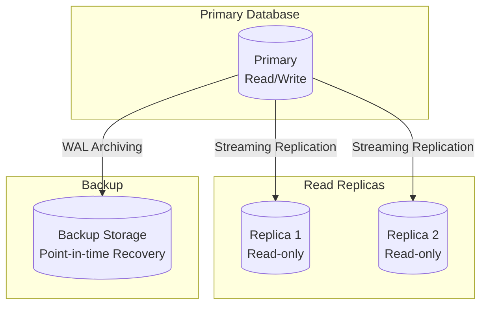

**Performance Optimizations**:
- JSONB indexes for flexible schema fields
- Partial indexes on active devices
- B-tree indexes on foreign keys
- Connection pooling via PgBouncer
- Read/write splitting in application

**Backup Strategy**:
- Continuous WAL archiving
- Daily full backups
- 30-day retention
- Point-in-time recovery capability

### Redis Configuration

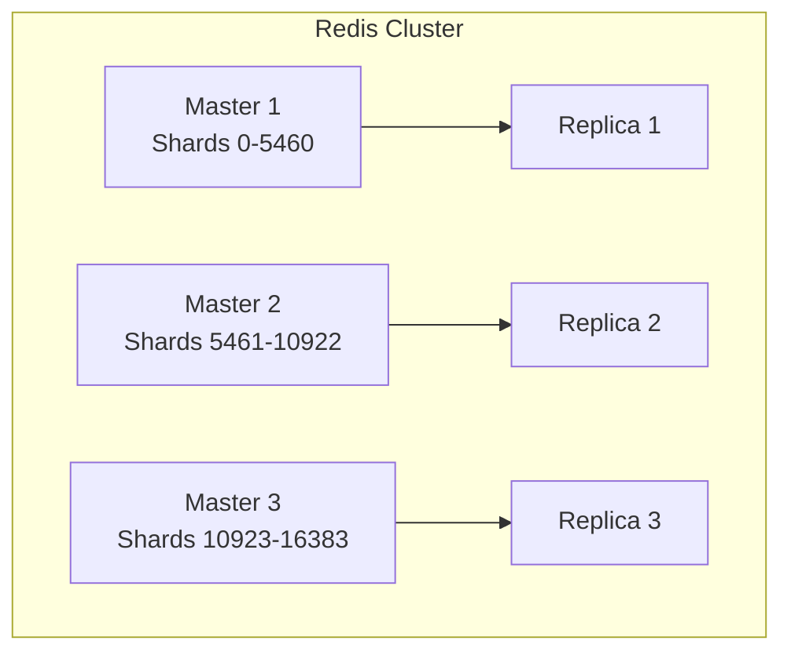

**Use Cases**:
- Queue backend (Laravel Horizon)
- Session storage
- Cache layer
- Rate limiting
- Pub/sub for broadcasting

**Configuration**:
- Persistence: AOF + RDB
- Memory policy: allkeys-lru for cache
- No eviction for queues

## Monitoring & Observability

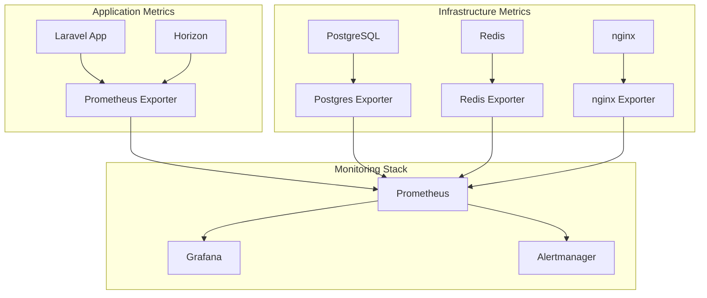

**Key Metrics**:
- Request rate and latency
- Queue depth and processing time
- Database connection pool usage
- Redis memory usage
- MQTT message rate
- Failed job rate

**Logging**:
- Structured JSON logs
- Centralized log aggregation (ELK/Loki)
- Log levels: DEBUG (dev), INFO (prod)
- Retention: 30 days

## Security

### Network Security

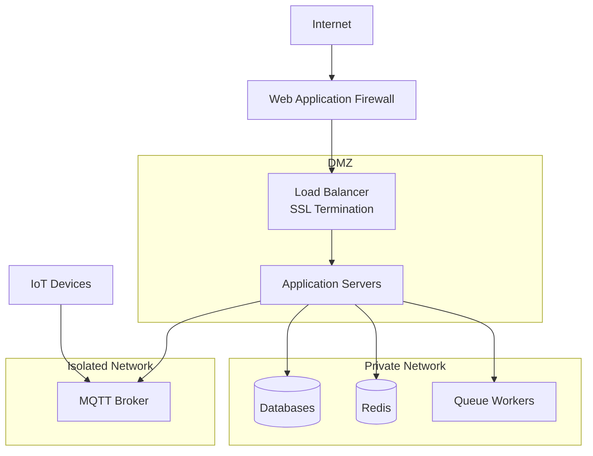

**Security Measures**:
- SSL/TLS for all external communications
- Database accessible only from private network
- MQTT broker with authentication and ACLs
- Regular security updates
- Secrets management via Kubernetes secrets or Vault

### Application Security

- **CSRF Protection**: All state-changing requests
- **SQL Injection**: Eloquent ORM with parameterized queries
- **XSS Prevention**: Blade template escaping
- **Rate Limiting**: Login attempts, API requests
- **Input Validation**: Form requests and validators
- **Security Headers**: CSP, HSTS, X-Frame-Options

## Disaster Recovery

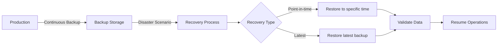

**RTO (Recovery Time Objective)**: < 4 hours
**RPO (Recovery Point Objective)**: < 15 minutes

**Backup Components**:
- Database dumps (full + incremental)
- Configuration files
- Uploaded files (device logos, etc.)
- Redis snapshots (optional)

## CI/CD Pipeline

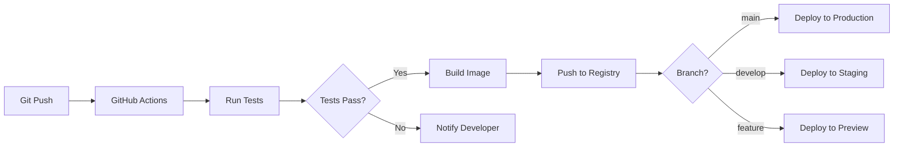

**Pipeline Steps**:
1. Lint (PHPStan, Pint)
2. Unit Tests (Pest)
3. Feature Tests
4. Build Docker image
5. Security scan
6. Push to registry
7. Deploy to environment
8. Smoke tests
9. Notification

## Scaling Considerations

### Vertical Scaling
- Increase CPU/memory for database
- Larger instance types for workers

### Horizontal Scaling
- Add more web server replicas
- Add more queue worker pods
- Redis cluster sharding
- Database read replicas

### Auto-scaling Rules
- CPU utilization > 70%
- Queue depth > 1000 jobs
- Response time > 500ms (p95)
