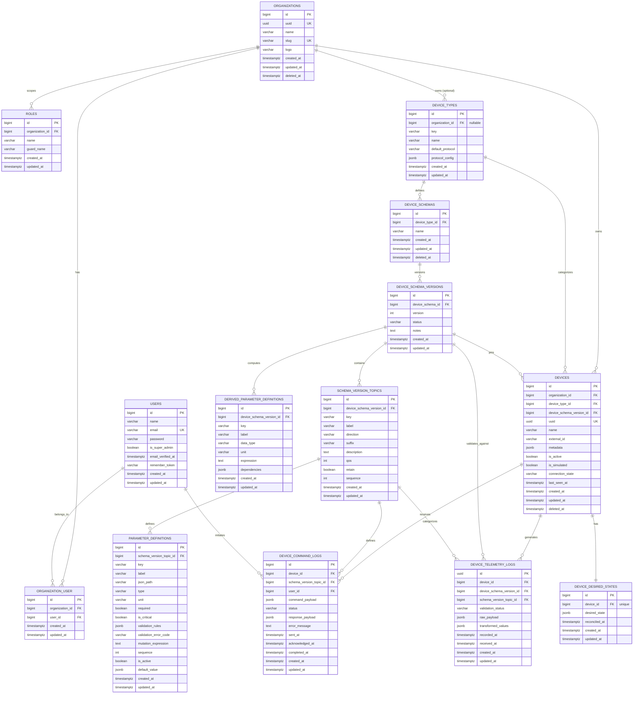
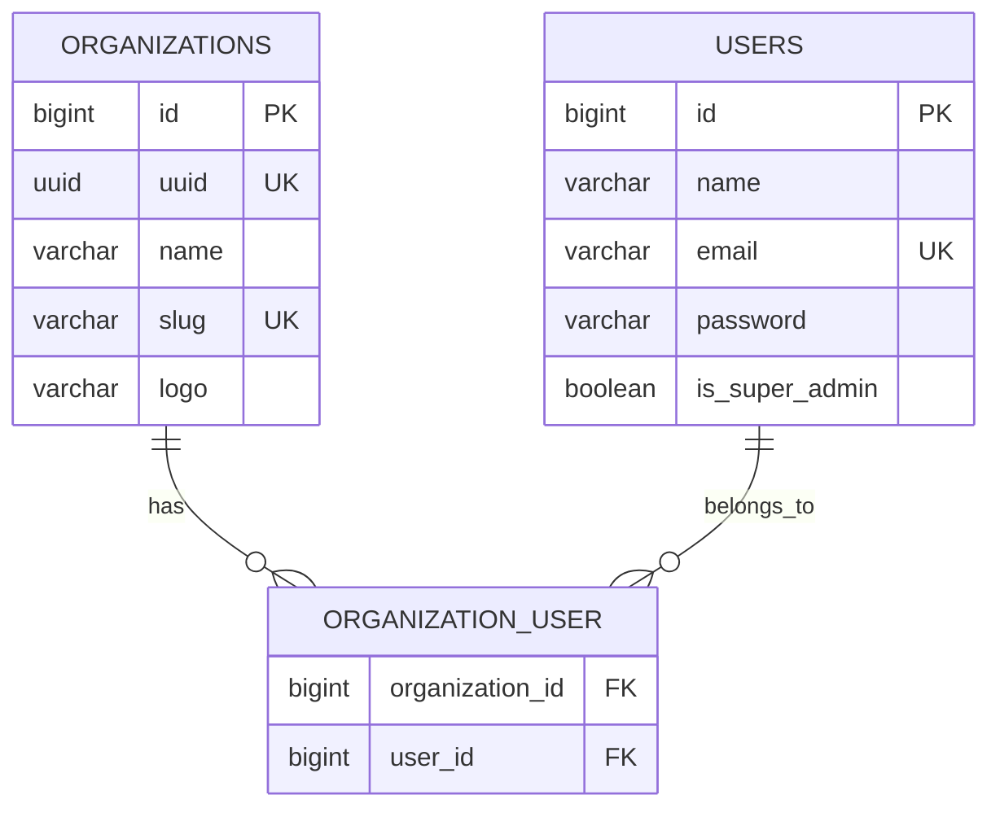
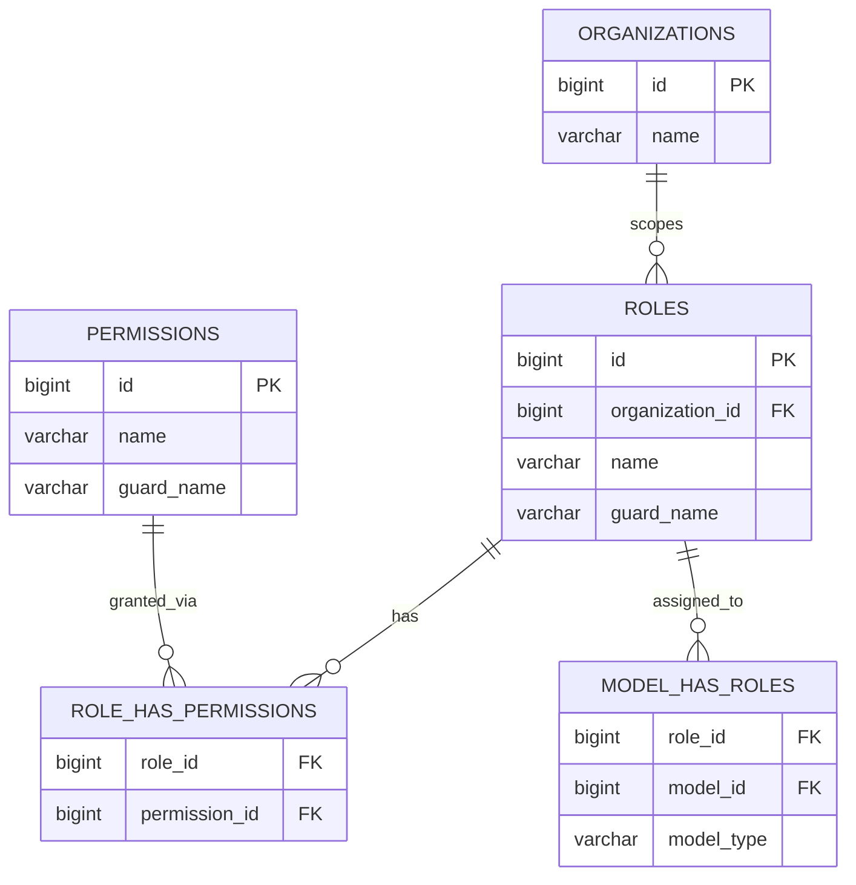
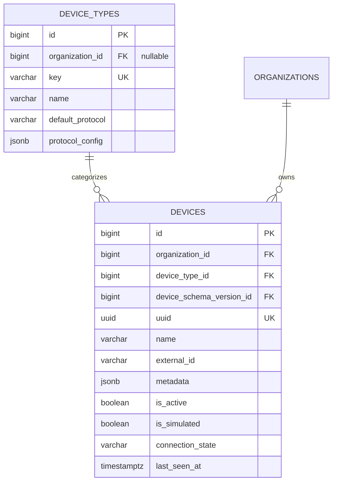
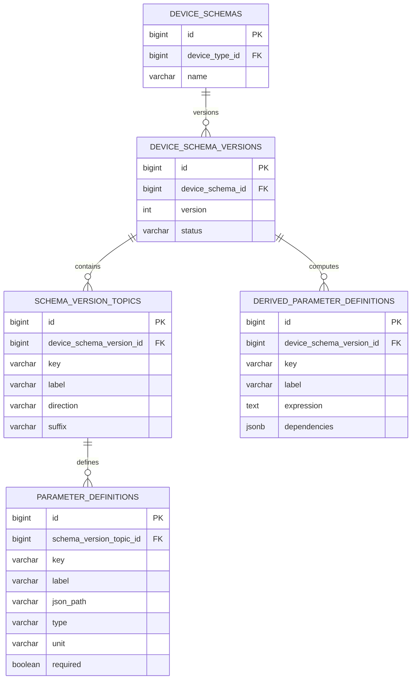
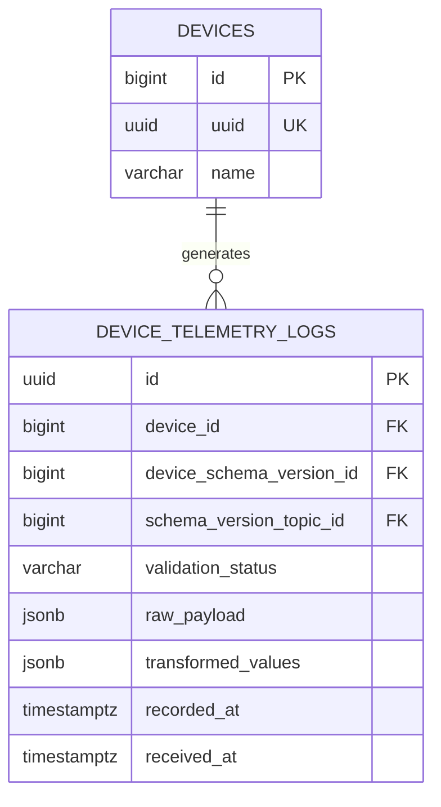
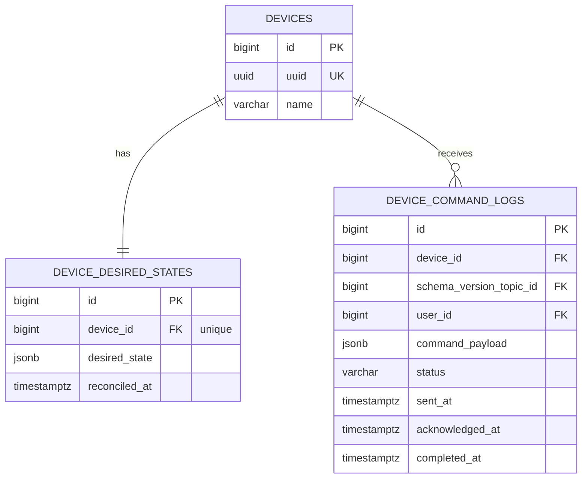

# Data Model & Database Schema

## Overview

The platform uses a normalized relational data model in PostgreSQL with JSONB fields for flexible schema storage.

## Complete Entity-Relationship Diagram



## Domain-Specific Views

### Shared Domain



### Authorization Domain



### Device Management Domain



### Device Schema Domain



### Telemetry Domain



### Device Control Domain



## Table Details

### Organizations

**Purpose**: Multi-tenant organization management

**Indexes**:
- Primary key on `id`
- Unique index on `uuid`
- Unique index on `slug`

**Key Features**:
- Soft deletes enabled
- UUID for public API access
- Slug for friendly URLs

---

### Users

**Purpose**: User authentication and profile

**Indexes**:
- Primary key on `id`
- Unique index on `email`

**Key Features**:
- Bcrypt password hashing
- Super admin flag for platform administrators
- Email verification support

---

### Device Types

**Purpose**: Device catalog (global and organization-specific)

**Indexes**:
- Primary key on `id`
- Unique index on `key` where `organization_id IS NULL` (global types)
- Unique index on `(organization_id, key)` where `organization_id IS NOT NULL`
- Foreign key on `organization_id`

**Key Features**:
- Nullable `organization_id` for global catalog
- Type-safe `protocol_config` cast to PHP classes
- Protocol enum: `mqtt`, `http`

---

### Device Schema Versions

**Purpose**: Versioned schema contracts

**Indexes**:
- Primary key on `id`
- Unique index on `(device_schema_id, version)`
- Foreign key on `device_schema_id`

**Status Values**:
- `draft`: Under development
- `active`: In use by devices
- `deprecated`: No longer recommended
- `archived`: Historical record only

**Key Features**:
- Immutability: Active versions cannot be modified
- Version number auto-increments per schema

---

### Schema Version Topics

**Purpose**: Organize parameters by topic/message type

**Indexes**:
- Primary key on `id`
- Unique index on `(device_schema_version_id, key)`
- Foreign key on `device_schema_version_id`

**Direction Values**:
- `inbound`: Device → Platform (telemetry)
- `outbound`: Platform → Device (commands)
- `bidirectional`: Both directions

**Key Features**:
- MQTT QoS levels (0, 1, 2)
- Retain flag for last value storage
- Sequence for ordering in UI

---

### Parameter Definitions

**Purpose**: Define telemetry parameters

**Indexes**:
- Primary key on `id`
- Index on `schema_version_topic_id`
- Index on `is_active`

**Type Values**:
- `integer`, `float`, `string`, `boolean`
- `timestamp`, `json`, `array`

**Key Features**:
- JSON path for value extraction
- JsonLogic validation rules
- JsonLogic mutation expressions
- Critical flag for mandatory validation

---

### Derived Parameter Definitions

**Purpose**: Computed parameters from other parameters

**Indexes**:
- Primary key on `id`
- Index on `device_schema_version_id`

**Key Features**:
- JsonLogic expressions for computation
- Dependencies array lists required parameters

---

### Devices

**Purpose**: Device instances

**Indexes**:
- Primary key on `id`
- Unique index on `uuid`
- Index on `organization_id`
- Index on `device_type_id`
- Index on `device_schema_version_id`
- Index on `(organization_id, is_active)`

**Connection State Values**:
- `connected`, `disconnected`, `unknown`

**Key Features**:
- UUID for MQTT topic identification
- External ID for integration with other systems
- Metadata JSONB for flexible attributes
- Simulation flag for testing
- Soft deletes enabled

---

### Device Telemetry Logs

**Purpose**: Incoming telemetry data storage

**Indexes**:
- Primary key on `id` (UUID v7 for time-based sorting)
- Index on `device_id`
- Index on `(device_id, recorded_at DESC)`
- Index on `validation_status`

**Validation Status Values**:
- `validated`: All parameters valid
- `partially_validated`: Some non-critical failures
- `failed`: Critical validation failures
- `error`: Processing error

**Key Features**:
- UUID v7 for natural time-based ordering
- Raw payload preserved for audit
- Transformed values after validation and mutation

---

### Device Desired States

**Purpose**: Target state for reconciliation

**Indexes**:
- Primary key on `id`
- Unique index on `device_id`

**Key Features**:
- One-to-one relationship with device
- JSONB for flexible state definition
- Reconciliation timestamp

---

### Device Command Logs

**Purpose**: Command execution audit trail

**Indexes**:
- Primary key on `id`
- Index on `device_id`
- Index on `(device_id, created_at DESC)`
- Index on `user_id`
- Index on `status`

**Status Values**:
- `pending`: Queued for sending
- `sent`: Published to device
- `acknowledged`: Device ACK received
- `completed`: Execution finished
- `failed`: Execution error
- `timeout`: No response within timeout

**Key Features**:
- Full command and response payload logging
- Timestamps for each stage of execution
- User attribution for audit

---

## JSONB Field Schemas

### protocol_config (Device Types)

**MQTT Protocol**:
```json
{
  "broker": {
    "host": "mqtt.example.com",
    "port": 1883,
    "use_tls": true
  },
  "topics": {
    "telemetry": "device/{uuid}/telemetry",
    "command": "device/{uuid}/command",
    "status": "device/{uuid}/status"
  },
  "qos": 1,
  "retain": false
}
```

**HTTP Protocol**:
```json
{
  "endpoint": "https://{device_host}/api/v1",
  "method": "POST",
  "headers": {
    "Content-Type": "application/json",
    "X-API-Version": "1.0"
  },
  "auth": {
    "type": "bearer",
    "token_field": "access_token"
  }
}
```

### validation_rules (Parameter Definitions)

```json
{
  "min": 0,
  "max": 100,
  "in": ["value1", "value2"],
  "regex": "^[A-Z]{3}$",
  "custom": {
    "and": [
      {">": [{"var": "value"}, 0]},
      {"<": [{"var": "value"}, 100]}
    ]
  }
}
```

### metadata (Devices)

```json
{
  "installation_date": "2026-01-15",
  "location": {
    "building": "Building A",
    "floor": 2,
    "room": "201"
  },
  "maintenance": {
    "last_service": "2026-01-01",
    "next_service": "2026-07-01"
  },
  "custom_fields": {
    "asset_id": "ASSET-12345"
  }
}
```

## Data Retention & Archival

- **Telemetry Logs**: 90 days in primary table, then archive to time-series DB
- **Command Logs**: Indefinite retention for audit
- **Soft Deleted Records**: 30 days, then permanent deletion
- **Active Sessions**: 24 hours idle timeout
