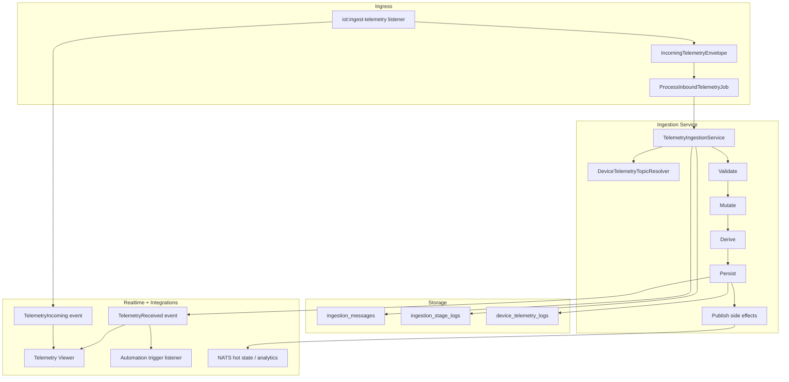

# Telemetry Module - Overview

## What This Module Does

The Telemetry module ingests device telemetry from NATS subjects, validates and transforms payloads using device schema definitions, persists durable telemetry logs, and emits post-ingestion signals for realtime UI and automation.

At a high level, the flow is:

1. Listen for inbound device telemetry.
2. Queue ingestion work.
3. Resolve the device/topic schema contract.
4. Validate, mutate, and derive values.
5. Persist telemetry and stage-level ingestion audit records.
6. Publish optional side effects (hot state + analytics).
7. Broadcast telemetry events for UI and downstream consumers.

## Core Concepts

| Concept | Description |
|--------|-------------|
| Incoming Envelope | Normalized incoming unit (`source_subject`, `mqtt_topic`, payload, message id, received time) |
| Ingestion Message | One end-to-end ingestion attempt (`ingestion_messages`) with dedupe key + final status |
| Ingestion Stage Log | Per-stage audit rows (`ingestion_stage_logs`) with duration, snapshots, errors |
| Device Telemetry Log | Durable telemetry record (`device_telemetry_logs`) with raw, mutated, transformed values |
| Validation Status | Domain payload quality status: `valid`, `warning`, `invalid` |
| Ingestion Status | Pipeline execution status: `queued`, `processing`, `completed`, `failed_validation`, `inactive_skipped`, `failed_terminal`, `duplicate` |
| Processing State | Telemetry row processing state: `processed`, `invalid`, `inactive_skipped`, `publish_failed` |
| Pre-Ingestion Event | `TelemetryIncoming` broadcast (stream preview before DB persist) |
| Post-Persist Event | `TelemetryReceived` broadcast (after durable telemetry write) |

## End-to-End Flow

## Module Boundaries

| In Scope | Out of Scope |
|----------|--------------|
| Ingestion orchestration and stage-level status tracking | Device control command lifecycle |
| Topic and schema resolution for publish topics | Generic stream processing outside configured schema topics |
| Payload validation, mutation, and derivation | Long-term retention cleanup automation (prepared model/config, no active retention worker yet) |
| Durable telemetry persistence + presence mark-online | Generic observability stack outside app tables/UI |
| Realtime telemetry events and viewer integration | Full automation DAG design/runtime internals |

## Current Entry Paths

| Entry Path | Purpose |
|------------|---------|
| `iot:ingest-telemetry` | Primary production-style pipeline entry (NATS listener + queue dispatch) |
| `DevicePublishingSimulator` (`iot:simulate`) | Simulated telemetry generation for testing and demos |
| `TelemetryLogRecorder` | Direct recording service currently used primarily by tests |

## Documentation Map

| Document | Focus |
|---------|-------|
| [02 - Architecture](02-architecture.md) | Components, dependencies, and data model |
| [03 - Ingestion Lifecycle and Stage Model](03-ingestion-lifecycle-and-stage-model.md) | Exact pipeline behavior and status transitions |
| [04 - Schema Contract, Validation, and Transformation](04-schema-contract-validation-and-transformation.md) | Topic contracts, parameter rules, mutation/derivation semantics |
| [05 - Events, Realtime, and Integrations](05-events-realtime-and-integrations.md) | Broadcast events, telemetry viewer, automation/presence integration |
| [06 - Observability and Troubleshooting](06-observability-and-troubleshooting.md) | Where to inspect failures and how to debug quickly |
| [07 - Operations and Performance](07-operations-and-performance.md) | Queue/Horizon strategy, throughput, and scaling patterns |
| [08 - Testing and Roadmap](08-testing-and-roadmap.md) | Test coverage summary and practical next phases |
