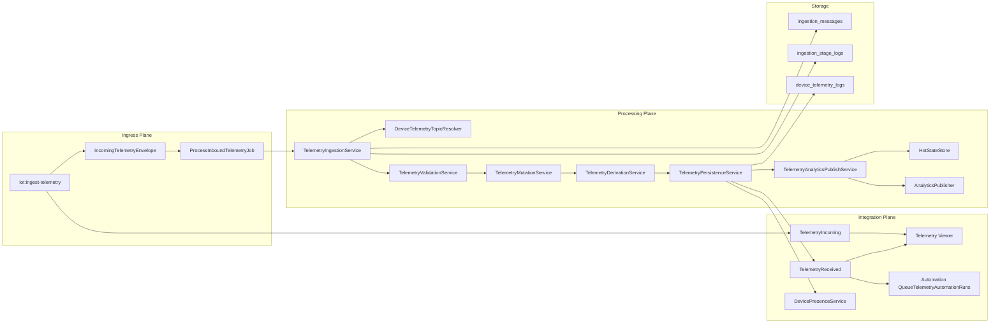
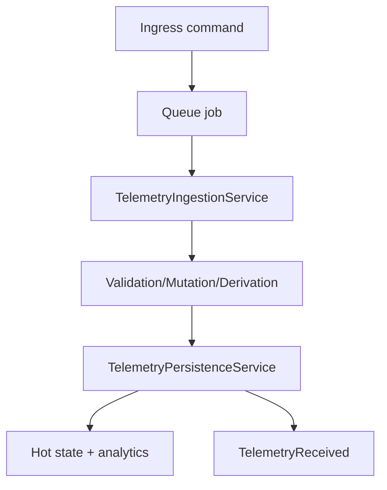
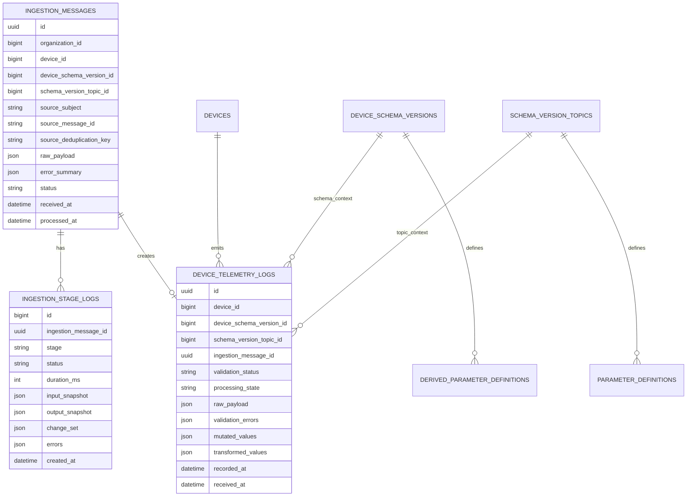

# Telemetry Module - Architecture

## Architectural Model

Telemetry is split into two planes:

1. Ingress plane: NATS subject listener and queueing.
2. Processing plane: deterministic stage pipeline and persistence.

## Component Responsibilities

| Component | Layer | Responsibility |
|-----------|------|----------------|
| `IngestTelemetryCommand` | Ingress | Subscribes to NATS subject, filters internal/analytics subjects, builds envelope, dispatches queue job |
| `IncomingTelemetryEnvelope` | DTO | Transport-neutral telemetry envelope + dedupe key generation |
| `ProcessInboundTelemetryJob` | Queue | Runs pipeline on configured queue/connection |
| `TelemetryIngestionService` | Orchestrator | Runs ordered stages, updates ingestion status, writes stage logs |
| `DeviceTelemetryTopicResolver` | Resolver | Maps MQTT topic to concrete `Device` + publish `SchemaVersionTopic` |
| `TelemetryValidationService` | Stage service | Extracts parameter values and evaluates validation rules |
| `TelemetryMutationService` | Stage service | Applies per-parameter mutation expressions |
| `TelemetryDerivationService` | Stage service | Computes derived parameters from dependency graph |
| `TelemetryPersistenceService` | Stage service | Persists `DeviceTelemetryLog`, marks presence online, fires `TelemetryReceived` |
| `TelemetryAnalyticsPublishService` | Stage service | Publishes analytics/invalid events via abstraction |
| `NatsKvHotStateStore` | Infra | Stores latest telemetry state in NATS KV |
| `NatsAnalyticsPublisher` | Infra | Publishes analytics/invalid payloads to NATS subjects |

## Dependency Direction

Telemetry follows one-way dependencies:

`Ingress -> Queue -> Orchestrator -> Stage Services -> Persistence/Publishers -> Events`

No lower layer depends on UI components.

## Service Container and Feature Gates

| Mechanism | Current Use |
|-----------|-------------|
| Container bindings | `HotStateStore` -> `NatsKvHotStateStore`, `AnalyticsPublisher` -> `NatsAnalyticsPublisher` |
| Feature flags (`FeatureServiceProvider`) | `ingestion.pipeline.enabled`, `ingestion.pipeline.driver`, `ingestion.pipeline.publish_analytics` |
| Config gates | `ingestion.publish_invalid_events`, `ingestion.capture_stage_snapshots` |

## Data Model (ER View)

## Storage Notes

| Area | Detail |
|------|--------|
| Telemetry table shape | `device_telemetry_logs` uses UUID id and `recorded_at` in composite primary key |
| Time-series optimization | If PostgreSQL is used, migration enables TimescaleDB hypertable on `recorded_at` |
| Query indexes | Status, recorded time, and ingestion foreign key indexes are present |
| Stage-level observability | Every stage writes `ingestion_stage_logs` row with duration and optional snapshots |
