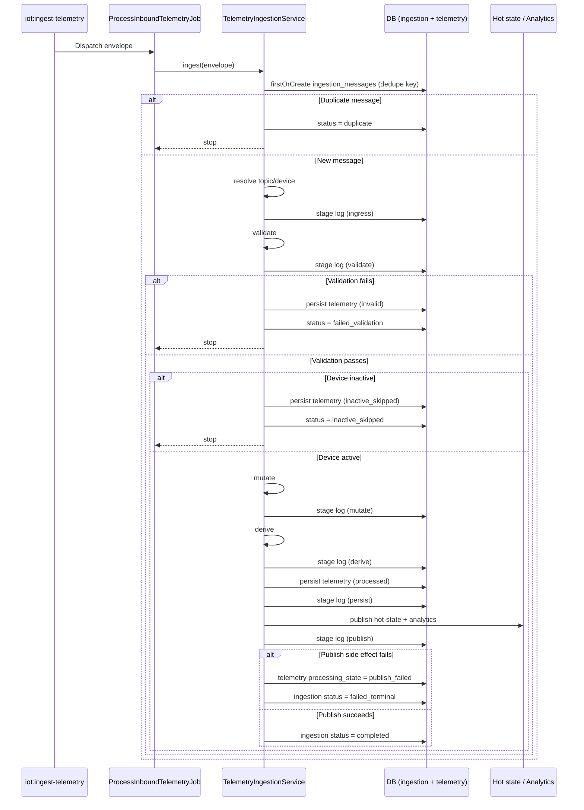
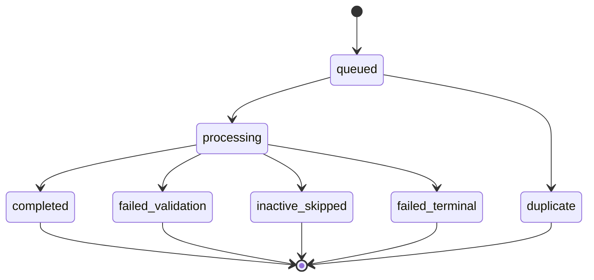

# Telemetry Module - Ingestion Lifecycle and Stage Model

## Lifecycle Summary

Each telemetry envelope becomes one `IngestionMessage` and advances through a staged pipeline.

## Stage Definitions

| Stage | Purpose | Typical Outputs |
|-------|---------|-----------------|
| `ingress` | Resolve incoming topic to device/topic context | Resolved `device_id`, `schema_version_topic_id` |
| `validate` | Extract parameter values and evaluate validation | `extracted_values`, validation status/errors |
| `mutate` | Apply per-parameter mutation expression | `mutated_values`, `change_set` |
| `derive` | Evaluate derived parameter expressions with dependencies | `derived_values`, `final_values` |
| `persist` | Write `device_telemetry_logs` row | `device_telemetry_log_id` |
| `publish` | Write hot-state and analytics side effects | `hot_state_written`, `analytics_published` |

## Ingestion Status State Machine

## Validation and Processing Semantics

| Condition | Ingestion Status | Telemetry Processing State |
|-----------|------------------|----------------------------|
| All checks pass, side effects succeed | `completed` | `processed` |
| Required/critical parameter check fails | `failed_validation` | `invalid` |
| Device is inactive | `inactive_skipped` | `inactive_skipped` |
| Publish side effect failure (KV or analytics) | `failed_terminal` | `publish_failed` |
| Envelope dedupe hit | `duplicate` | No additional telemetry row |

## Deduplication Rules

Dedupe is keyed by `source_deduplication_key` in `ingestion_messages`.

1. If transport message id exists (`Nats-Msg-Id`), dedupe key is stable for repeats of that message id.
2. If message id is absent, dedupe key includes `received_at`, so repeated payloads at different times are treated as distinct telemetry events.

This behavior prevents accidental drops when upstream transport does not provide stable message identifiers.

## Stage Log Capture Behavior

Stage logs are always written, but input/output snapshots are controlled by config:

- `INGESTION_CAPTURE_STAGE_SNAPSHOTS=true`: snapshots stored in `input_snapshot` and `output_snapshot`.
- `INGESTION_CAPTURE_STAGE_SNAPSHOTS=false`: stage logs keep status/duration/errors without payload snapshots.

## Early-Termination Paths

| Path | Stop Point | Why |
|------|------------|-----|
| Unknown topic | After `ingress` failure log | Topic not mapped to registered publish schema topic |
| Missing schema version on resolved device | Before validation | Device cannot be evaluated without schema contract |
| Validation fail | After `validate` | Invalid payload should not continue to mutate/derive |
| Inactive device | After `validate` | Persist for audit, skip runtime side effects |
| Side-effect publish fail | After `publish` | Persisted telemetry retained, ingestion marked failed terminal |
