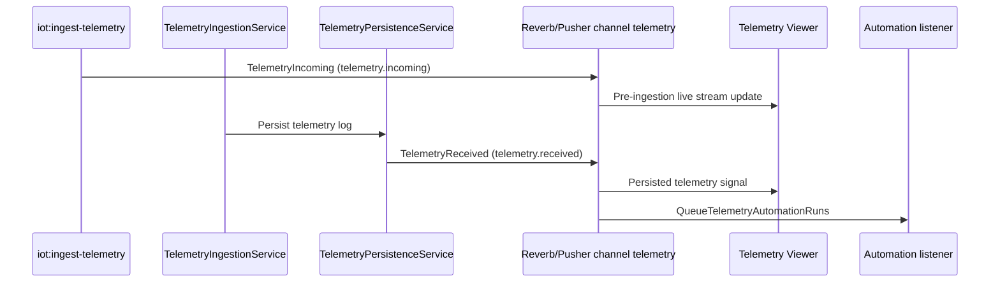

# Telemetry Module - Events, Realtime, and Integrations

## Event Timeline

Telemetry emits two key broadcast events at different pipeline points.

## Broadcast Events

| Event | Broadcast Name | Channel | Emission Point | Typical Use |
|------|-----------------|---------|----------------|-------------|
| `TelemetryIncoming` | `telemetry.incoming` | `telemetry` | Listener stage, before DB persist | Live raw stream visibility |
| `TelemetryReceived` | `telemetry.received` | `telemetry` | After `DeviceTelemetryLog` persistence | Downstream processing and persisted feed visibility |

## Telemetry Viewer Integration

The Filament Telemetry Viewer provides two operational views:

1. Pre-ingestion stream panel (Livewire component) filtered by device + topic suffix, listening to `telemetry.incoming`.
2. Ingestion health diagnostics panel showing publish failure counts and latest failure reasons from persisted telemetry + ingestion error summaries.

Viewer page entry: `App\Filament\Admin\Pages\TelemetryViewer`

## Telemetry Logs Resource Integration

`DeviceTelemetryLogResource` exposes persisted telemetry for operations and debugging:

- List view with filters for validation status, processing state, and recorded time range.
- Detail view with raw, validation error, mutated, and transformed payload snapshots.
- Device relation manager integration inside Device resource.

## Automation Integration

`TelemetryReceived` is wired to `QueueTelemetryAutomationRuns` in `AppServiceProvider`.

Implication:

- Every persisted telemetry record can trigger automation matching.
- Automation matching/queueing is decoupled from ingestion internals and runs through its own queue path and config gates.

## Presence Integration

`TelemetryPersistenceService` calls `DevicePresenceService::markOnline` on successful persistence.

Operationally, this means telemetry ingest doubles as a presence heartbeat source for devices that may not emit separate presence packets.

## Side-Effect Integration (Analytics + Hot State)

After persistence, the pipeline can publish:

- Hot state writes through `HotStateStore` abstraction.
- Analytics/invalid events through `AnalyticsPublisher` abstraction.

Default concrete implementations are NATS-backed:

- `NatsKvHotStateStore`
- `NatsAnalyticsPublisher`

This abstraction keeps telemetry pipeline logic stable while allowing publisher backends to evolve.
