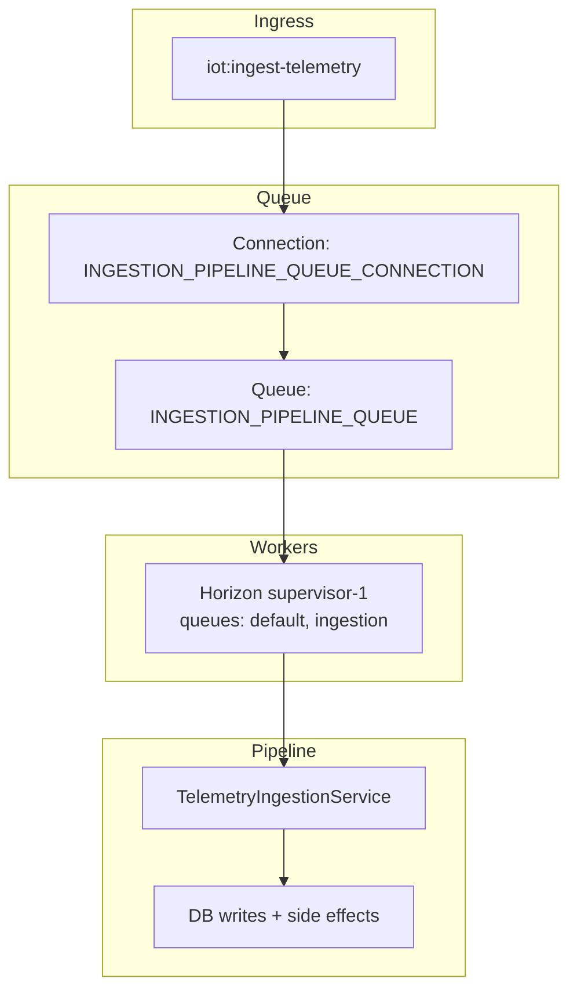

# Telemetry Module - Operations and Performance

## Runtime Topology

## Key Operational Configuration

| Config | Default | Effect |
|--------|---------|--------|
| `INGESTION_PIPELINE_ENABLED` | `true` | Hard gate for ingestion runtime |
| `INGESTION_PIPELINE_DRIVER` | `laravel` | Driver gate used by feature flag |
| `INGESTION_PIPELINE_QUEUE_CONNECTION` | `redis` | Queue connection for ingestion job |
| `INGESTION_PIPELINE_QUEUE` | `ingestion` | Queue name for ingestion job |
| `INGESTION_REGISTRY_TTL_SECONDS` | `30` | Topic registry cache refresh window |
| `INGESTION_CAPTURE_STAGE_SNAPSHOTS` | `true` | Enables stage input/output snapshot storage |
| `INGESTION_PIPELINE_PUBLISH_ANALYTICS` | `true` | Enables analytics publish side effect |
| `INGESTION_PIPELINE_PUBLISH_INVALID` | `true` | Enables invalid-event publish side effect |

## Throughput and Scaling Strategy

### 1. Scale by queues and workers first

Preferred first step:

- Increase Horizon worker processes handling `ingestion` queue.
- Keep ingestion isolated from long-running simulation workloads.
- Monitor queue wait and stage durations before deeper architectural changes.

### 2. Keep ingestion idempotent and short

Current design already supports this:

- Dedup key at `ingestion_messages` prevents duplicate downstream writes.
- Side effects happen after persistence, so telemetry durability is prioritized.
- Publish failures are terminal-marked without data loss.

### 3. Control storage pressure

- Disable stage snapshots (`INGESTION_CAPTURE_STAGE_SNAPSHOTS=false`) in high-volume environments where payload-level debugging is not always required.
- Use `processing_state` and status indexes for efficient operational queries.
- On PostgreSQL, leverage Timescale hypertable behavior for time-range scans.

### 4. Registry behavior and topic churn

- Resolver uses TTL refresh, not per-message DB lookups.
- If topic/device config churn is high, lower TTL or introduce explicit refresh triggers as a next enhancement.

## Performance Characteristics by Stage

| Stage | Cost Driver | Scaling Lever |
|------|-------------|---------------|
| Ingress + dedupe | DB upsert on dedupe key | DB index health, partitioning strategy |
| Validate | Parameter count and rule complexity | Schema simplification, rule design |
| Mutate/derive | Expression complexity and dependency depth | Expression hygiene, bounded derived chains |
| Persist | DB write latency | DB tuning, connection pool sizing |
| Publish | External NATS/KV and analytics latency | Side effect backend health, retry strategy (future) |

## Reliability Posture

Current resilience traits:

- Durable telemetry persistence is prioritized before side effects.
- Side effect failure does not discard telemetry.
- Duplicate ingress is explicitly represented (`duplicate`) rather than silently ignored.

Recommended next reliability steps:

1. Add retry/backoff policy for publish side effects.
2. Add dead-letter strategy for repeated terminal publish failures.
3. Add explicit retention jobs for ingestion and telemetry tables using profile defaults.

## Notes on Concurrency Model

For this module, queue-based parallelism with Horizon is the pragmatic path.

- It aligns with Laravel operational tooling already in use.
- It keeps isolation and failure semantics straightforward.
- It avoids introducing event-loop/fiber complexity before throughput data justifies it.

In practice, optimize worker topology and queue partitioning before considering lower-level concurrency primitives.
