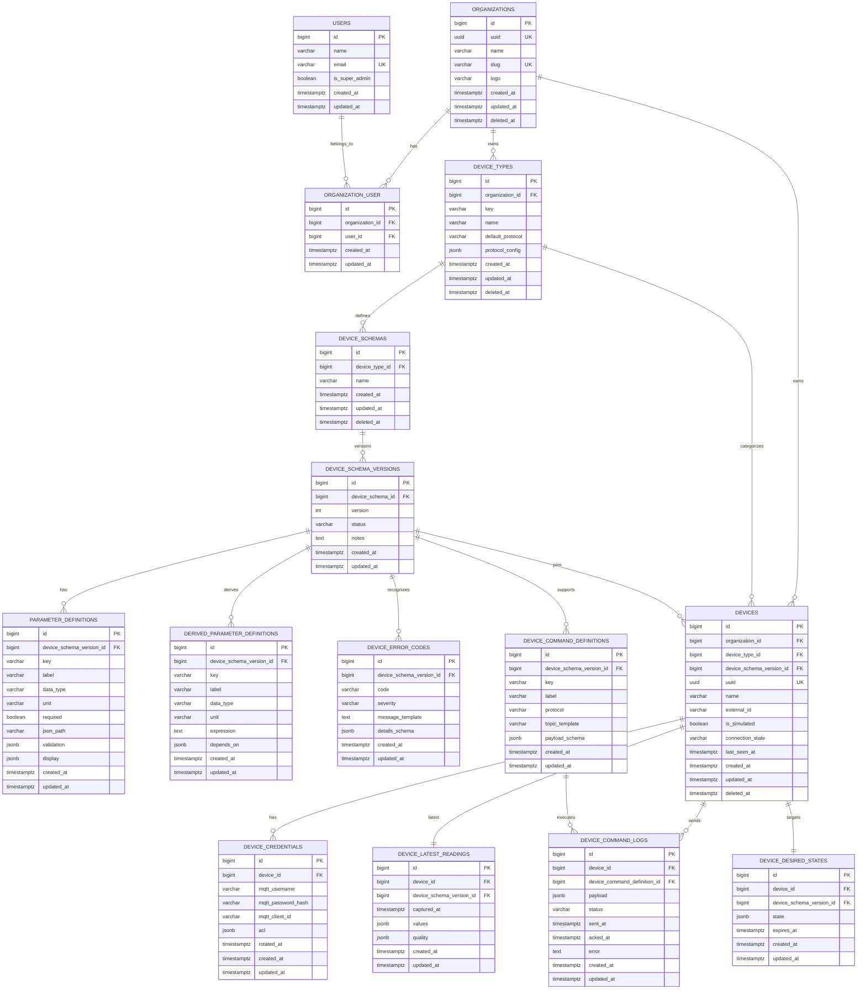

# Phase 1 Core ERD

## Architectural Notes

### Device Types: Global Catalog + Org Overrides
- `device_types.organization_id` is **nullable**.
- Global types (organization_id = NULL) are shared across all orgs (e.g., standard energy meters, LED actuators).
- Org-specific types (organization_id set) allow orgs to define custom device types.
- Uniqueness: `key` must be unique for global types; `(organization_id, key)` must be unique for org-specific types.

### Protocol Config: Type-Safe Class Architecture
Instead of storing untyped JSON, `protocol_config` is serialized/deserialized to protocol-specific classes:
- **Interface**: `App\Domain\IoT\Contracts\ProtocolConfigInterface` defines the contract.
- **MQTT**: `App\Domain\IoT\ProtocolConfigs\MqttProtocolConfig` with broker settings, topic templates, QoS, etc.
- **HTTP**: `App\Domain\IoT\ProtocolConfigs\HttpProtocolConfig` with endpoints, method, headers, auth type, etc.
- **Cast**: `App\Domain\IoT\Casts\ProtocolConfigCast` deserializes based on `default_protocol` value.
- **Enum**: `App\Domain\IoT\Enums\Protocol` (Mqtt, Http).

Topic templates use placeholders (e.g., `device/:device_uuid/data`, `device/:device_uuid/ctrl`) replaced at runtime.

### Device Instance Scoping
- `devices` table is **always** org-scoped (organization_id NOT NULL).
- Each device pins to a specific `device_schema_version_id` at registration (immutable contract).
- `devices.uuid` is the stable public identifier used in MQTT topics and API calls.

### Command & Control
- **Command definitions**: per schema version, define allowed commands with payload schemas.
- **Desired state**: per device, stores target state for reconciliation.
- **Command logs**: audit trail of sent commands with status and acknowledgment timestamps.

