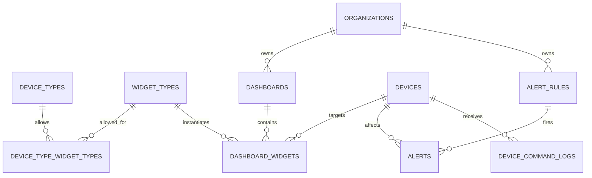

# Phase 2+ ERD (Dashboards, Widgets, Rules) — Draft

This file documents the planned extension tables that come **after** Phase 1 core configuration schema is implemented and reviewed.

## Planned tables
- `widget_types`
- `device_type_widget_types` (pivot)
- `dashboards`
- `dashboard_widgets`
- `alert_rules`
- `alerts`
- `device_command_logs`

## Relationship sketch (high-level)

## Notes
- These tables are intentionally not part of Phase 1 migrations to keep the “schema foundation” small and correct.
- Once Phase 1 is merged, we can refine this diagram with concrete columns and constraints.

